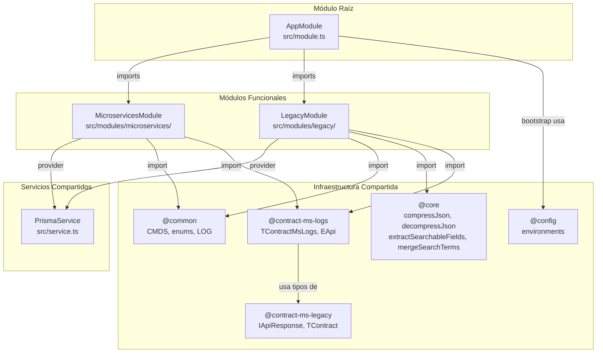

# Dependencias Cross-Módulo — `muvin-ms-logs`

> **Última revisión:** 2026-04-21
> **Alcance:** dependencias internas entre módulos del MS (no dependencias npm)

---

## Diagrama de dependencias

---

## Análisis de dependencias problemáticas

### ⚠️ PrismaService instanciado dos veces
`PrismaService` se declara como `provider` tanto en `MicroservicesModule` como en `LegacyModule`. Esto crea **dos instancias separadas** del Prisma Client, lo que puede generar:
- Mayor consumo de conexiones a MySQL
- Estado inconsistente si Prisma maneja caché de queries

**Solución recomendada:** Convertir `PrismaService` en un módulo global (`@Global()`) o moverlo a un `DatabaseModule` compartido. Ver [[deuda-tecnica]].

### ⚠️ @contract-ms-legacy en un MS de logging
`LegacyModule` importa `@contract-ms-legacy` para tipos relacionados con la API legada. Esto introduce acoplamiento entre el MS de logs y el contrato del sistema legado. Si el contrato legado cambia, puede romper el MS de logs.

### 💀 @contract-ms-legacy/interfaces/ — uso desconocido
La carpeta `src/contracts/ms-legacy/interfaces/` existe y contiene `comprador-by-razon-social.ts`. No se detectó uso de este archivo en los módulos analizados. Posible **código muerto**.

---

## Tabla de dependencias directas por módulo

| Módulo | Depende de | Tipo de dependencia |
|--------|-----------|-------------------|
| `AppModule` | `MicroservicesModule` | NestJS `imports` |
| `AppModule` | `LegacyModule` | NestJS `imports` |
| `AppModule` | `@config` (environments) | Import directo en `main.ts` |
| `MicroservicesModule` | `PrismaService` | NestJS provider |
| `MicroservicesModule` | `@common` (CMDS, LOG) | Import directo |
| `MicroservicesModule` | `@contract-ms-logs` | Tipos TypeScript |
| `LegacyModule` | `PrismaService` | NestJS provider |
| `LegacyModule` | `@common` (CMDS, EStatus, LOG) | Import directo |
| `LegacyModule` | `@core` (compressJson, terms) | Import directo |
| `LegacyModule` | `@contract-ms-logs` | Tipos TypeScript |
| `LegacyModule` | `@contract-ms-legacy` | Tipos TypeScript (IApiResponse) |

---

## Dependencias circulares

**No se detectaron dependencias circulares** entre módulos. El grafo es acíclico.

---

*Ver también: [[depends-matrix]] · [[core-vs-custom-dependencies]] · [[deuda-tecnica]]*
