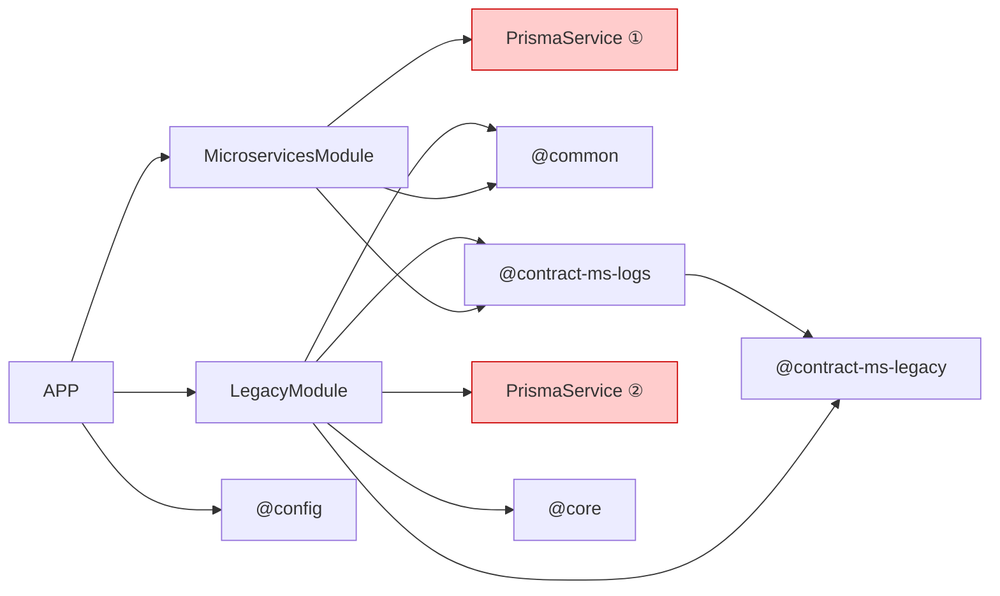

# Matriz de Dependencias — `muvin-ms-logs`

> **Última revisión:** 2026-04-21
> **Convención:** ✔ = dependencia directa confirmada | — = sin dependencia | 🚧 = a verificar

---

## Matriz N×N de módulos funcionales

Las **filas** son el módulo que **depende de** (consumidor).
Las **columnas** son el módulo **del que se depende** (proveedor).

| | `AppModule` | `MicroservicesModule` | `LegacyModule` | `PrismaService` | `@common` | `@core` | `@config` | `@contract-ms-logs` | `@contract-ms-legacy` |
|---|---|---|---|---|---|---|---|---|---|
| **`AppModule`** | — | ✔ ¹ | ✔ ¹ | — | — | — | ✔ ² | — | — |
| **`MicroservicesModule`** | — | — | — | ✔ ³ | ✔ ⁴ | — | — | ✔ ⁵ | — |
| **`LegacyModule`** | — | — | — | ✔ ³ | ✔ ⁴ | ✔ ⁶ | — | ✔ ⁵ | ✔ ⁷ |
| **`PrismaService`** | — | — | — | — | — | — | — | — | — |
| **`@common`** | — | — | — | — | — | — | — | — | — |
| **`@core`** | — | — | — | — | — | — | — | — | — |
| **`@config`** | — | — | — | — | — | — | — | — | — |
| **`@contract-ms-logs`** | — | — | — | — | — | — | — | — | ✔ ⁷ |
| **`@contract-ms-legacy`** | — | — | — | — | — | — | — | — | — |

---

## Notas al pie

| # | Tipo de dependencia | Descripción |
|---|---------------------|-------------|
| ¹ | NestJS `imports[]` | `AppModule` declara ambos módulos funcionales en su array de imports |
| ² | Import directo en `main.ts` | `environments` se importa en el bootstrap para obtener host/port/transport |
| ³ | NestJS `providers[]` | `PrismaService` se declara como provider en ambos módulos — **dos instancias distintas** ⚠️ |
| ⁴ | Import de módulo TypeScript | `CMDS`, `EStatus`, `LOG` se importan directamente desde el barrel `@common` |
| ⁵ | Tipos TypeScript | `TContractMsLogs` y `EApi` se usan para tipar payloads de los `@MessagePattern` |
| ⁶ | Import de módulo TypeScript | `compressJsonFn`, `decompressJsonFn`, `extractSearchableFieldsFn`, `mergeSearchTermsFn` |
| ⁷ | Tipos TypeScript | `IApiResponse` de `@contract-ms-legacy` se importa en `@contract-ms-logs` para estructurar respuestas |

---

## Visualización compacta de dependencias

> 🔴 Los nodos `PrismaService ①` y `PrismaService ②` representan **dos instancias distintas** del mismo servicio — problema de diseño. Ver [[deuda-tecnica]].

---

*Ver también: [[cross-module-dependencies]] · [[core-vs-custom-dependencies]] · [[deuda-tecnica]]*
