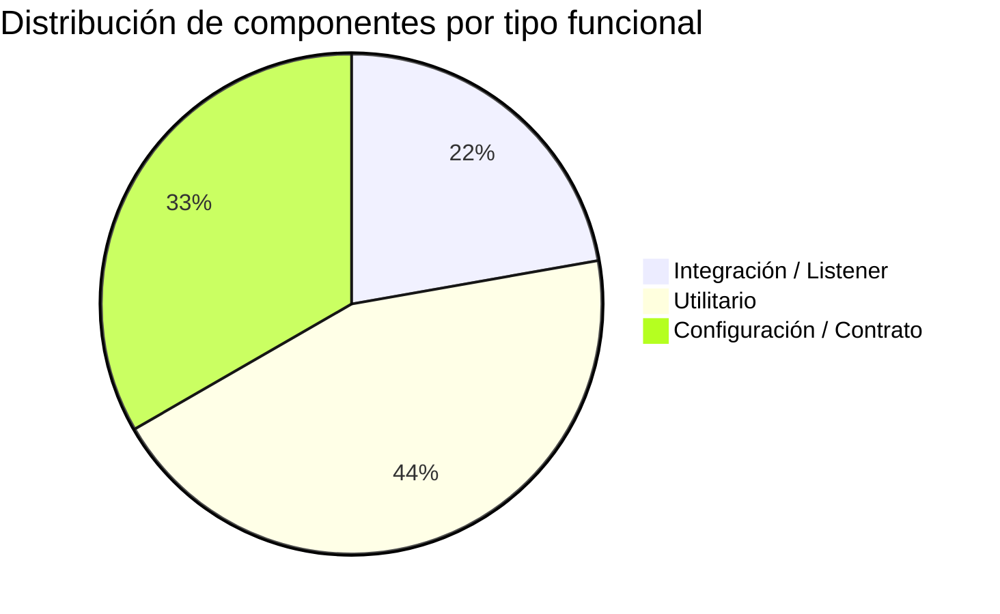

# Clasificación Funcional de Módulos — `muvin-ms-logs`

> **Última revisión:** 2026-04-21
> **Fuente:** Inspección de controllers, services y schema Prisma

---

## Tabla de clasificación

| Módulo / Componente | Tipo funcional | Sub-tipo | Descripción resumida |
|---------------------|----------------|----------|----------------------|
| `MicroservicesModule` | Integración | Listener TCP | Recibe y persiste trazas de operaciones GraphQL y eventos de microservicios |
| `LegacyModule` | Integración + CRUD | Listener TCP + Búsqueda | Registra y consulta logs de los sistemas legados PANEL y DESCARGAS |
| `PrismaService` | Utilitario | Conexión BD | Singleton de Prisma Client, punto único de acceso a MySQL |
| `core/utils/json.ts` | Utilitario | Compresión | Compresión/descompresión Brotli de payloads JSON |
| `core/utils/terms.ts` | Utilitario | Búsqueda | Extracción y merge de términos buscables del dominio de negocio |
| `common/functions/logger.ts` | Utilitario | Logging | Wrapper de NestJS Logger con colores en consola |
| `common/cmd/constant.ts` | Configuración | Message patterns | Define los strings de routing TCP del microservicio |
| `config/environments.ts` | Configuración | Variables de entorno | Validación y tipado de env vars con Joi |
| `contracts/ms-logs/` | Configuración | Contrato público | Tipos TypeScript que los clientes TCP deben cumplir |

---

## Distribución por tipo funcional

---

## Clasificación expandida con criticidad

| Módulo | Tipo | Criticidad | Justificación |
|--------|------|-----------|---------------|
| `MicroservicesModule` | Integración | 🔴 Alta | Es el receptor de trazas del gateway GraphQL — si falla, se pierden logs de auditoría |
| `LegacyModule` | Integración + CRUD | 🔴 Alta | Gestiona el histórico de requests de los sistemas legados, incluye búsqueda |
| `PrismaService` | Utilitario | 🔴 Alta | Punto único de falla de BD — toda la persistencia pasa por aquí |
| `core/utils/json.ts` | Utilitario | 🟡 Media | Si falla, los payloads legacy no se pueden almacenar ni leer |
| `core/utils/terms.ts` | Utilitario | 🟡 Media | Afecta la calidad de la búsqueda por términos de negocio |
| `common/functions/logger.ts` | Utilitario | 🟢 Baja | Impacto solo en observabilidad, no en funcionalidad |
| `common/cmd/constant.ts` | Configuración | 🔴 Alta | ⚠️ BUG ACTIVO: `event.update` duplicado — ver [[deuda-tecnica]] |
| `config/environments.ts` | Configuración | 🔴 Alta | Si la validación falla, el MS no arranca |
| `contracts/ms-logs/` | Configuración | 🟡 Media | Romper el contrato rompe la integración con clientes |

---

## No existen en este MS

Los siguientes tipos funcionales **no están presentes** en `muvin-ms-logs`:

| Tipo | ¿Existe? | Nota |
|------|----------|------|
| 📊 Reportes | ❌ No | El MS almacena datos pero no genera reportes |
| 🧙 Wizards / Asistentes | ❌ No | No hay flujos de múltiples pasos guiados |
| 🔄 Procesos batch / scheduled | ❌ No | No hay `@Cron`, `setInterval` ni jobs programados |
| 🌐 Endpoints HTTP REST | ❌ No | Solo TCP — sin controladores HTTP |
| 🔐 Módulo de autenticación | ❌ No | El MS no autentica — confía en la red interna |
| 📤 Eventos de salida / publishers | ❌ No | Solo consume mensajes entrantes, no publica |

---

*Ver también: [[reports-and-wizards-inventory]] · [[modulo-microservices]] · [[modulo-legacy]]*
