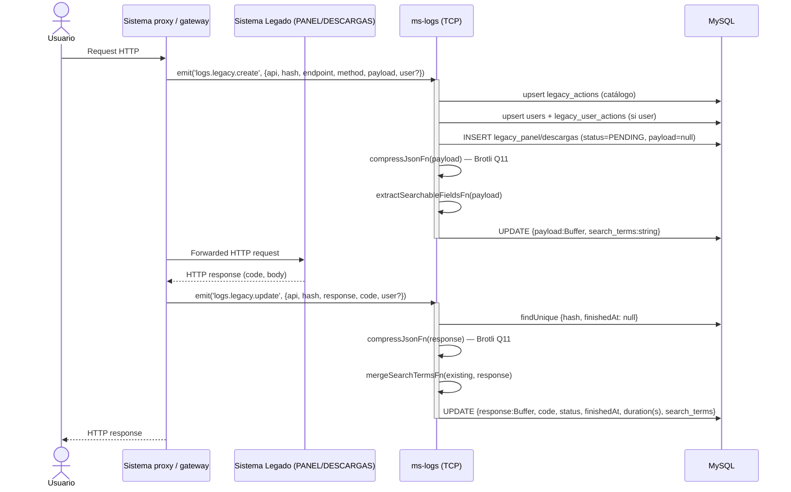
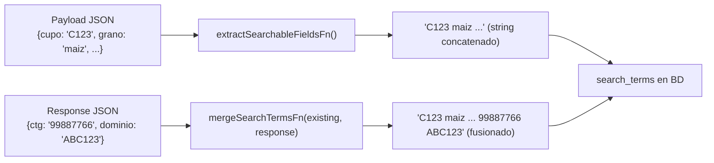

# Flujo: Logging de Request Legado

> **Contexto:** [[_indice-flujos]] · [[modulo-legacy]]
> **Actores:** Sistema legado o gateway proxy, ms-logs (TCP receiver), MySQL

## Descripción

Cada request HTTP hacia un sistema legado genera **2 mensajes TCP** hacia ms-logs:
1. `legacy.create` — al inicio del request (antes de enviarlo al sistema legado)
2. `legacy.update` — al recibir la respuesta del sistema legado

El proceso incluye Brotli compression, extracción de términos de búsqueda (dominio agrícola) y mantenimiento automático de catálogo de endpoints y mirror de usuarios.

## Diagrama de secuencia



## Extracción de términos de búsqueda

Al momento del `create` y del `update`, se extraen valores de dominio del payload/response:



## Ventana de inconsistencia

```
Tiempo →

T0: INSERT (payload=null, status=PENDING)       ← registro existe sin payload
T1: UPDATE payload=Buffer, search_terms=...     ← registro completo (create)
...
T2: INSERT  ← legacy.update recibido
T3: UPDATE response, status, finishedAt...      ← registro finalizado
```

Entre T0 y T1 hay una ventana donde el registro puede ser consultado con `payload = null`. Si la app falla entre T0 y T1, el payload se pierde permanentemente.

## Manejo de usuarios tardíos

Si `legacy.create` se envió sin `user` y `legacy.update` incluye `user`:

```
legacy.update → detecta record.user = null y payload.user != null
             → _upsertUser() se llama con void (background)
             → Si falla, no hay registro del error
```

---

*Ver también: [[flujo-tracing-graphql]] · [[legacy-create]] · [[legacy-update]] · [[entidad-legacy]]*
