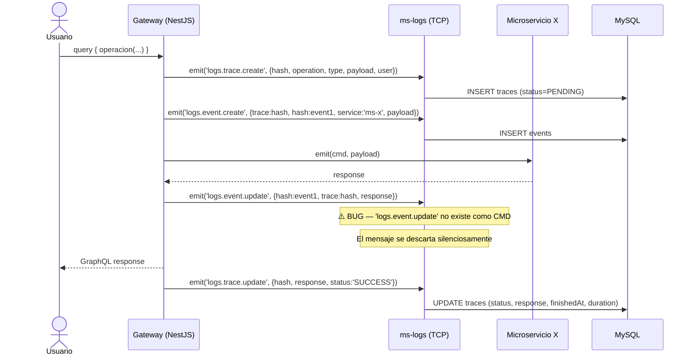
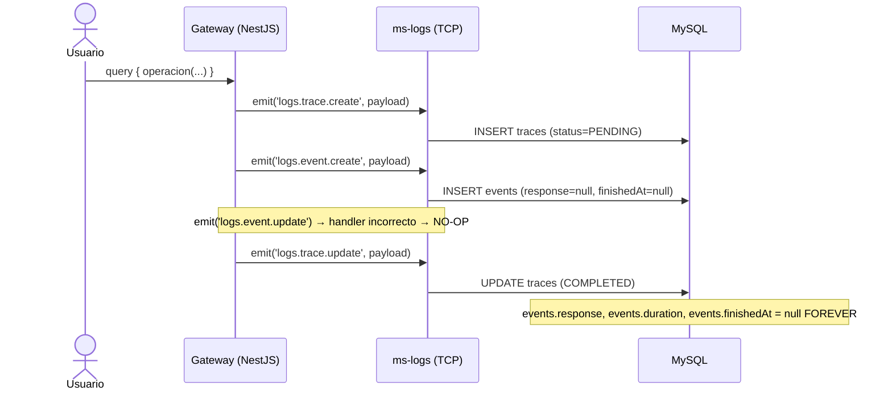

# Flujo: Tracing de Operación GraphQL

> **Contexto:** [[_indice-flujos]] · [[modulo-microservices]]
> **Actores:** Gateway (NestJS interceptor), ms-logs (TCP receiver), MySQL

## Descripción

Una operación GraphQL completa genera hasta **N+2 mensajes TCP** hacia ms-logs:
- 1 mensaje `trace.create` al inicio
- N mensajes `event.create` (uno por cada microservicio llamado durante la resolución)
- N mensajes `event.update` (uno por respuesta de cada MS — 🔴 BUG: nunca llegan al handler correcto)
- 1 mensaje `trace.update` al finalizar

## Diagrama de secuencia — Estado diseñado



## Diagrama de secuencia — Estado real actual



## Correlación entre entidades

| Campo | Valor | Une con |
|-------|-------|---------|
| `traces.hash` | Correlation ID de la traza | `events.trace` |
| `events.hash` | Correlation ID del evento individual | — (propio) |
| `events.trace` | Mismo valor que `traces.hash` | Agrupa todos los eventos de una traza |

## Uso esperado del hash

El hash es generado por el gateway **antes de enviar los mensajes**, típicamente como UUID o hash del request. No existe validación de formato en `ms-logs` — cualquier string de hasta 50 chars es aceptado.

## Estado actual de la tabla events

```
events:
  response    → NULL (100% de los registros)
  duration    → NULL (100% de los registros)
  finishedAt  → NULL (100% de los registros)
```

Ver [[microservices-event-update]] y [[deuda-tecnica]] para el fix.

---

*Ver también: [[flujo-legacy-logging]] · [[entidad-traces]] · [[entidad-events]]*
