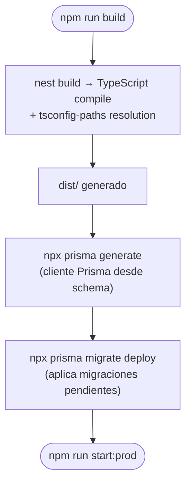

# Build y Despliegue

> **Contexto:** [[requisitos-entorno]] · [[configuracion]]

## Scripts npm disponibles

| Script | Comando | Descripción |
|--------|---------|-------------|
| `build` | `nest build` | Compila TypeScript a `dist/` con ts-paths resueltos |
| `start` | `nest start` | Inicia en modo desarrollo (sin watch) |
| `start:dev` | `nest start --watch` | Inicia con hot reload |
| `start:debug` | `nest start --debug --watch` | Debug mode + hot reload |
| `start:prod` | `node dist/main` | Inicia desde el build compilado |
| `lint` | `eslint "{src,apps,libs,test}/**/*.ts" --fix` | Lint + autofix |
| `format` | `prettier --write "src/**/*.ts"` | Formateo |
| `test` | `jest` | Tests (actualmente no hay tests) |
| `test:watch` | `jest --watch` | Tests en watch mode |
| `test:cov` | `jest --coverage` | Tests con cobertura |

## Flujo de build para producción



> ⚠️ Los pasos de `prisma generate` y `prisma migrate deploy` NO están en los scripts de `package.json`. Se deben ejecutar manualmente o via CI/CD antes de iniciar en producción.

## Docker

### Solo MySQL (estado actual)

```bash
cd docker/
docker compose up -d
```

Levanta solo MySQL 8.0 en puerto `3306` con base de datos `db_logs`.

### Stack completo (requiere descommentar)

El servicio `muvin-ms-logs` en `docker/docker-compose.yml` está comentado. Para habilitar:

1. Descomentar el bloque del servicio en `docker/docker-compose.yml`
2. Asegurarse que el `Dockerfile` en `docker/Dockerfile` existe y es correcto
3. `docker compose up -d --build`

> ⚠️ Las credenciales de MySQL en `docker-compose.yml` están hardcodeadas (`muvin/muvin`). Ver [[security-inventory]].

## Migraciones Prisma

| Comando | Descripción |
|---------|-------------|
| `npx prisma migrate dev` | Crea y aplica migraciones en desarrollo |
| `npx prisma migrate deploy` | Solo aplica migraciones en producción (sin crear nuevas) |
| `npx prisma migrate status` | Muestra qué migraciones están pendientes |
| `npx prisma generate` | Regenera el cliente Prisma desde el schema |
| `npx prisma studio` | GUI de BD en el browser |

La única migración existente está en `prisma/migrations/20251021181757_/migration.sql` — crea las 7 tablas iniciales.

---

*Ver también: [[requisitos-entorno]] · [[configuracion]]*
