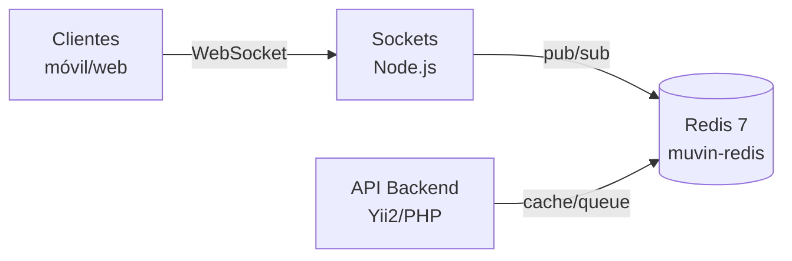

# Visión General — Redis Muvin

## ¿Qué es este proyecto?

Repositorio que define y gestiona el despliegue del servicio **Redis** en la infraestructura de la plataforma Muvin. Redis actúa como broker de mensajes y caché en tiempo real, siendo consumido principalmente por el servicio de [[servicio-sockets|Sockets]].

## Rol en el ecosistema Muvin

## Responsabilidades

- **Caché** — respuestas de API con alta frecuencia de lectura.
- **Pub/Sub** — canal de mensajería entre el backend y el servicio de sockets.
- **Colas** (si aplica) — procesamiento asíncrono de tareas.

## Ambientes gestionados

| Ambiente | Workflow | Red Docker | Puerto |
|----------|----------|-----------|--------|
| dev | `deploy-dev.yml` | `muvin-net` | `6379` |
| cap | `sync-cap.yml` (sync a repo externo) | `muvin-net` | `6379` |

> [!note]
> Los ambientes **uat** y **prd** no tienen workflows configurados en este repositorio aún.

## Características del despliegue

- Contenedor con `--restart always` → se reinicia automáticamente ante fallos.
- Red `muvin-net` compartida con otros servicios del stack.
- Sin persistencia de datos configurada (volatile cache).
- Secretos SSH gestionados desde **HashiCorp Vault**.

## Referencias

- [[arquitectura-alto-nivel]]
- [[stack-tecnologico]]
