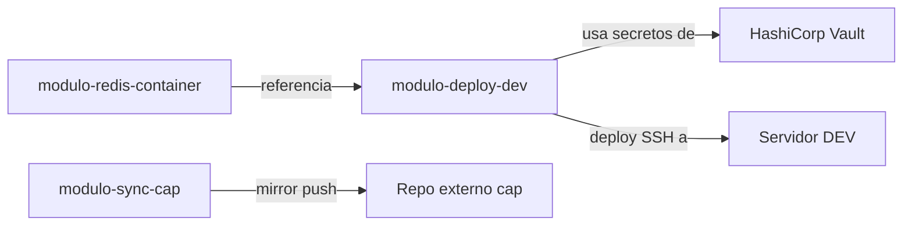

# Índice de Módulos — Redis Muvin

| Módulo | Archivo | Descripción |
|--------|---------|-------------|
| [[modulo-redis-container]] | `docker/docker-compose.yml` | Definición del contenedor Redis |
| [[modulo-deploy-dev]] | `.github/workflows/deploy-dev.yml` | Pipeline de deploy automático en dev |
| [[modulo-sync-cap]] | `.github/workflows/sync-cap.yml` | Sincronización del repo hacia cap |

## Mapa de dependencias

