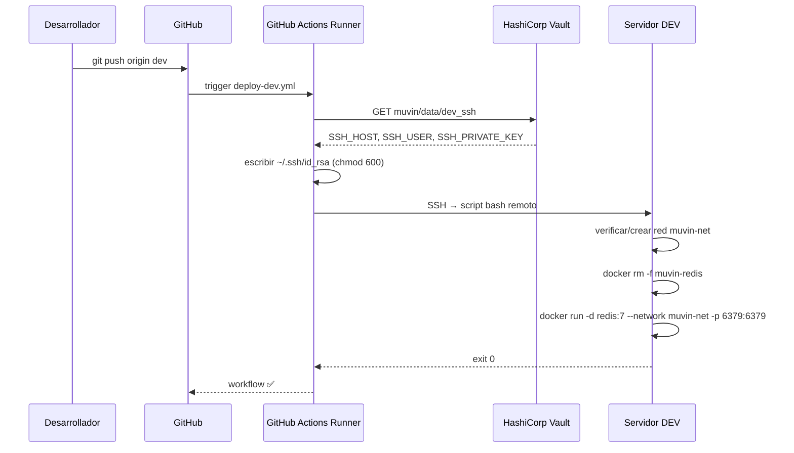

# Funcionalidad: Deploy Automático

## Descripción

Al hacer `git push` sobre la rama `dev`, GitHub Actions despliega Redis en el servidor de desarrollo sin intervención manual.

## Flujo

## Precondiciones

- La rama `dev` debe existir y recibir el push.
- El secret `VAULT_TOKEN` debe estar configurado en GitHub Secrets.
- Vault debe estar accesible en `https://vault.alternativasinteligentes.com`.
- El servidor destino debe tener Docker instalado.
- El usuario SSH debe tener permisos para ejecutar `docker` (grupo `docker` o `sudo`).

## Postcondiciones

- Contenedor `muvin-redis` corriendo con `redis:7`.
- Puerto `6379` expuesto en el host.
- Red `muvin-net` existente y el contenedor conectado a ella.
- `--restart always` garantiza que Redis se levanta tras reinicios del servidor.

## Referencias

- [[modulo-deploy-dev]]
- [[funcionalidad-idempotencia-deploy]]
