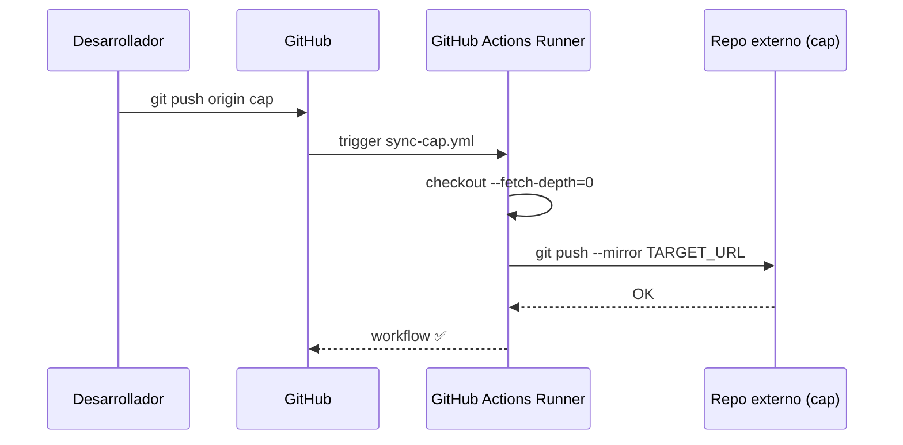

# Funcionalidad: Sincronización hacia Cap

## Descripción

Al hacer push a la rama `cap`, el repositorio se sincroniza como espejo hacia un repositorio externo (probablemente GitLab), habilitando el pipeline de cap en ese sistema.

## Trigger

- `push` a rama `cap`
- `delete` de rama `cap` (propaga la eliminación)

## Comportamiento

## Diferencia con otros repos

En `config-deploys`, la sincronización va de GitHub → GitLab para todos los ambientes en un solo workflow. En `redis`, cada ambiente tiene su propio workflow de sync.

## Referencias

- [[modulo-sync-cap]]
