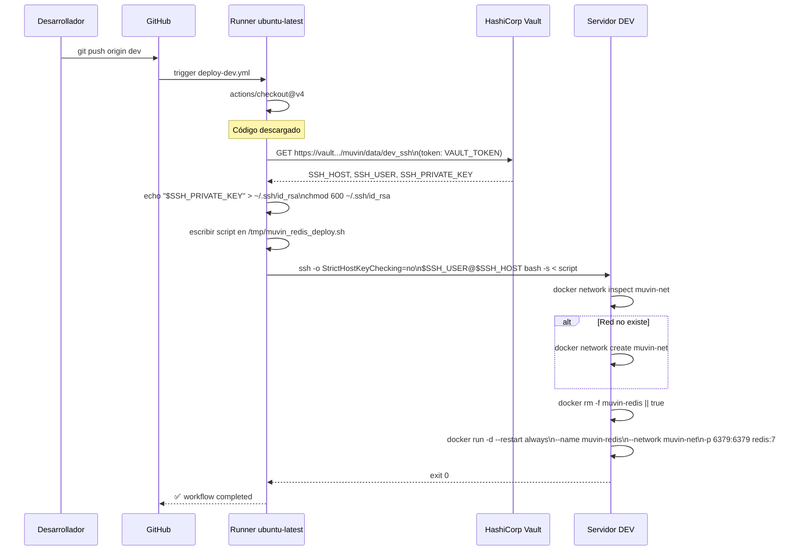

# Flujo: Deploy Dev

## Diagrama completo

## Tiempo estimado de ejecución

| Step | Tiempo aprox. |
|------|--------------|
| Checkout | ~5s |
| Vault action | ~5s |
| Setup SSH | ~1s |
| Deploy (SSH + Docker) | ~15-30s (pull de imagen si no está en caché) |
| **Total** | **~30-45s** |

## Ventana de downtime

Entre `docker rm -f` y `docker run` hay ~2-5 segundos donde Redis no está disponible. Los clientes conectados perderán conexión momentáneamente.

## Referencias

- [[modulo-deploy-dev]]
- [[funcionalidad-deploy-automatico]]
- [[funcionalidad-idempotencia-deploy]]
