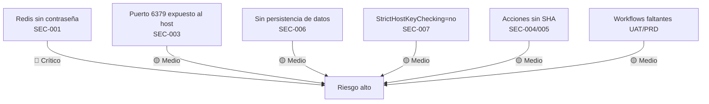

# Hotspots — Redis Muvin

> Componentes con mayor riesgo técnico u operativo.

## Mapa de riesgo



## Tabla de hotspots

| # | Componente | Severidad | Riesgo |
|---|-----------|-----------|--------|
| 1 | Redis sin `requirepass` | 🔴 Alto | Cualquier proceso en `muvin-net` puede leer/escribir/flush datos |
| 2 | `-p 6379:6379` (bind all interfaces) | 🟡 Medio | Accesible desde la red del servidor si el firewall no bloquea el puerto |
| 3 | Sin volumen de persistencia | 🟡 Medio | Datos perdidos ante reinicio del contenedor o del servidor |
| 4 | `StrictHostKeyChecking=no` | 🟡 Medio | Vulnerable a ataques MITM durante el deploy |
| 5 | Acciones GitHub sin SHA | 🟡 Medio | Supply chain risk |
| 6 | Workflows UAT/PRD ausentes | 🟡 Medio | Ambientes sin pipeline de deploy definido |
| 7 | Inconsistencia de nombre de red (`muvin-net` vs `muvin-net-dev`) | 🟢 Bajo | Confusión operativa entre entorno local y real |

## Hotspot más crítico: Redis sin autenticación

> [!danger]
> Un atacante (o bug) que logre ejecutar código en cualquier contenedor de la red `muvin-net` puede ejecutar `redis-cli FLUSHALL` y borrar todos los datos, o leer sesiones/caché sensible.

**Corrección inmediata (5 minutos):**
```bash
docker run -d \
  --restart always \
  --name muvin-redis \
  --network muvin-net \
  -p 127.0.0.1:6379:6379 \
  redis:7 \
  redis-server --requirepass "$(openssl rand -hex 32)"
```

Guardar la contraseña generada en Vault: `muvin/data/redis → REDIS_PASSWORD`.

## Referencias

- [[security-inventory]]
- [[deuda-tecnica]]
