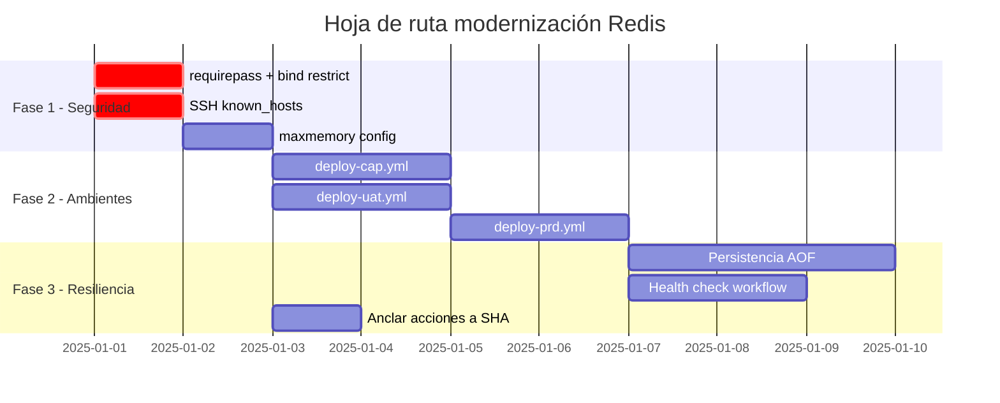

# Recomendaciones de Modernización — Redis Muvin

## Estado actual vs. objetivo

| Dimensión | Estado actual | Objetivo |
|-----------|--------------|----------|
| Autenticación Redis | Sin contraseña | `requirepass` desde Vault |
| Bind de puerto | `0.0.0.0:6379` | `127.0.0.1:6379` |
| Persistencia | Ninguna | Volumen con AOF o RDB según criticidad |
| SSH host verification | `StrictHostKeyChecking=no` | `known_hosts` pre-poblado |
| Acciones GitHub | Versiones flotantes | Ancladas a SHA |
| Ambientes cubiertos | Solo dev + cap (sync) | dev + cap + uat + prd |
| Límite de memoria | Sin límite | `maxmemory 256mb` + `allkeys-lru` |

---

## Fase 1 — Seguridad urgente (1-2 días)

### 1.1 Agregar contraseña y restricción de bind

Modificar el script de deploy en `deploy-dev.yml`:
```bash
docker run -d \
  --restart always \
  --name $CONTAINER_NAME \
  --network $NETWORK_NAME \
  -p 127.0.0.1:6379:6379 \
  $IMAGE \
  redis-server --requirepass "$REDIS_PASSWORD" \
               --maxmemory 256mb \
               --maxmemory-policy allkeys-lru
```

Agregar en Vault `muvin/data/dev_redis → REDIS_PASSWORD` e importarlo en el workflow.

### 1.2 Corregir SSH host verification

```yaml
- name: Setup SSH Key
  run: |
    mkdir -p ~/.ssh/
    echo "${{ env.SSH_PRIVATE_KEY }}" > ~/.ssh/id_rsa
    chmod 600 ~/.ssh/id_rsa
    ssh-keyscan ${{ env.SSH_HOST }} >> ~/.ssh/known_hosts  # ← agregar esto
```

---

## Fase 2 — Completar cobertura de ambientes (1 semana)

Crear `deploy-uat.yml` y `deploy-prd.yml` siguiendo el mismo patrón que `deploy-dev.yml`, con las rutas de Vault correspondientes:

```
muvin/data/uat_ssh → SSH_HOST, SSH_USER, SSH_PRIVATE_KEY
muvin/data/uat_redis → REDIS_PASSWORD
```

Crear también `deploy-cap.yml` (actualmente solo existe `sync-cap.yml` que sincroniza el código pero no despliega).

---

## Fase 3 — Resiliencia y observabilidad (2-4 semanas)

### 3.1 Persistencia de datos (si es necesaria)

```bash
docker run -d \
  --restart always \
  --name muvin-redis \
  --network muvin-net \
  -p 127.0.0.1:6379:6379 \
  -v /opt/redis-data:/data \           # volumen de persistencia
  redis:7 \
  redis-server --requirepass "$REDIS_PASSWORD" \
               --appendonly yes \       # AOF persistence
               --maxmemory 256mb \
               --maxmemory-policy allkeys-lru
```

### 3.2 Health check en el workflow

```yaml
- name: Verify Redis is healthy
  run: |
    ssh ${{ env.SSH_USER }}@${{ env.SSH_HOST }} \
      "docker exec muvin-redis redis-cli -a '$REDIS_PASSWORD' ping | grep -q PONG"
```

### 3.3 Anclar acciones a SHA

```yaml
# Antes:
- uses: actions/checkout@v2
# Después:
- uses: actions/checkout@11bd71901bbe5b1630ceea73d27597364c9af683  # v4.2.2
```

---

## Mapa de evolución



## Referencias

- [[hotspots]]
- [[deuda-tecnica]]
- [[security-inventory]]
