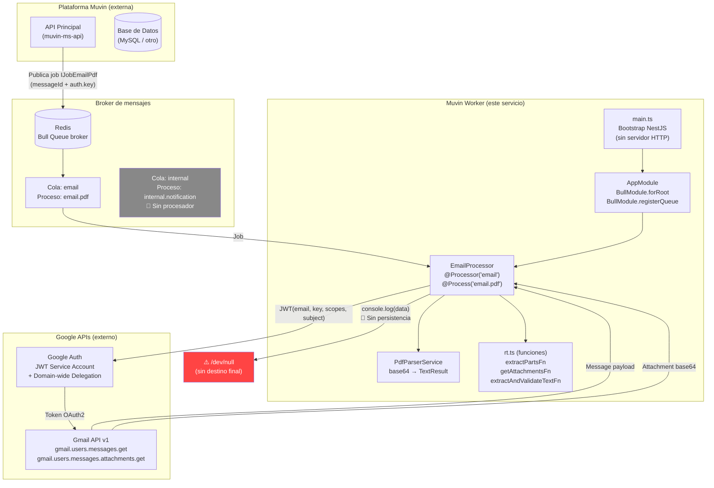
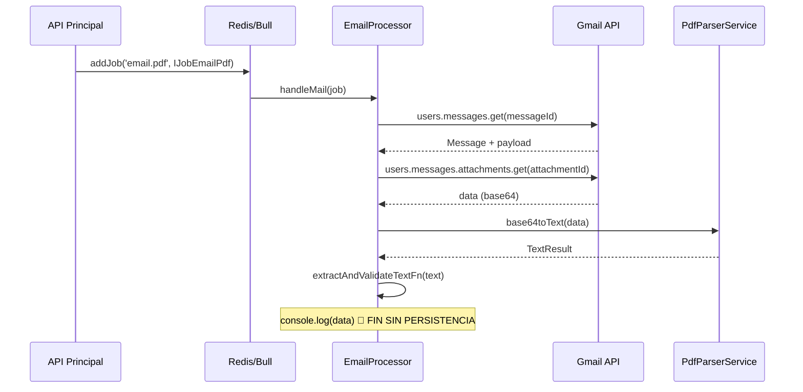

# Arquitectura de Alto Nivel

> **Proyecto:** `muvin-ms-worker`
> **Última revisión:** 2026-04-21
> **Ver también:** [[vision-general]], [[stack-tecnologico]], [[cross-module-dependencies]]

---

## Diagrama de arquitectura

---

## Capas del sistema

### Capa 1 — Infraestructura de mensajería (Redis + Bull)

El punto de entrada real del worker no es un endpoint HTTP sino un job de Bull consumido desde Redis.

- **Broker:** Redis (host/port configurados vía env `HOST` y `PORT`)
- **Cola activa:** `email` — proceso `email.pdf`
- **Cola declarada pero inactiva:** `internal` — proceso `internal.notification`
- **Publicador de jobs:** el API principal (externo a este proyecto)

### Capa 2 — NestJS Application Layer

NestJS actúa como framework de DI y ciclo de vida, pero **no expone ningún servidor HTTP**. `NestFactory.create()` es llamado pero no se invoca `app.listen()`.

- `AppModule`: registra `BullModule` con la conexión Redis y las colas
- `EmailProcessor`: decorator `@Processor` registra el procesador en Bull

### Capa 3 — Procesamiento (lógica de negocio)

El procesador `handleMail` orquesta el flujo completo:

1. Construye cliente Gmail con credenciales JWT del job
2. Obtiene el mensaje completo desde la API de Gmail
3. Extrae partes recursivamente (`extractPartsFn`)
4. Filtra adjuntos PDF (`getAttachmentsFn`)
5. Descarga cada adjunto en base64
6. Convierte base64 → texto plano (`PdfParserService`)
7. Parsea y valida los campos del certificado (`extractAndValidateTextFn`)

### Capa 4 — Integraciones externas

- **Gmail API v1:** acceso de solo lectura a mensajes y adjuntos de cuentas corporativas de Google Workspace
- **Autenticación:** JWT de cuenta de servicio con Domain-wide Delegation (DWD)

### Capa 5 — Output (incompleto 🔴)

Actualmente el resultado del procesamiento se descarta vía `console.log()`. No hay:
- Escritura en base de datos
- Llamada de vuelta al API principal
- Publicación en otra cola
- Emisión de evento

---

## Flujo de datos simplificado

