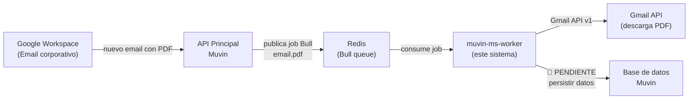

# Visión General

> **Proyecto:** `muvin-ms-worker`
> **Versión:** 1.0.0
> **Framework:** NestJS v11
> **Tipo:** Worker asíncrono headless (sin servidor HTTP)

---

## ¿Qué es este sistema?

`muvin-ms-worker` es un proceso background de la plataforma **Muvinapp** — un sistema de gestión para el sector agroindustrial argentino especializado en la transferencia de depósitos de granos bajo la normativa del SENASA/AFIP.

El worker consume jobs de una cola Redis (Bull) publicados por el API principal de Muvin, accede a cuentas de Gmail corporativas usando Domain-wide Delegation (DWD) de Google Workspace, descarga y parsea los PDF de certificados de transferencia de granos adjuntos en esos correos, y extrae los datos estructurados del certificado.

---

## Contexto del dominio

En Argentina, las operaciones de almacenamiento y transferencia de granos están reguladas por el sistema SENASA. Cuando se transfiere la propiedad de un depósito de granos de una empresa a otra, se emite un **Certificado de Depósito y Transferencia (CDT)** que contiene:

- El **COE** (Código Único de Operación Electrónica)
- Los CUITs del depositario, depositante y receptor
- El tipo y cantidad de grano (en kilos)
- La campaña agrícola (ej: 2324 = campaña 2023/2024)
- El número de planta y certificado

Estos certificados llegan por email a las empresas usuarias de Muvinapp. El worker automatiza la extracción de estos datos para evitar el ingreso manual.

---

## Posición en la arquitectura Muvinapp

---

## Alcance actual

| ✅ Implementado | ❌ No implementado |
|----------------|-------------------|
| Consumo de jobs de la cola Bull `email` | Persistencia del resultado en BD |
| Autenticación Gmail con JWT + DWD | Cola `internal` (sin procesador) |
| Extracción de partes MIME del mensaje | Tests automatizados |
| Descarga de adjuntos PDF | Logging estructurado |
| Parseo de texto del PDF | Monitoreo / alertas |
| Extracción y validación de campos del certificado | Redis autenticado (en producción) |

---

## Limitaciones conocidas más importantes

1. **Los datos procesados se descartan** — `console.log()` reemplaza la persistencia real (ver [[deuda-tecnica#DT-01]])
2. **Solo 2 granos soportados** — TRIGO PAN y SOJA (ver [[deuda-tecnica#DT-03]])
3. **Cosechas expiran en 2029** — catálogo hardcodeado (ver [[deuda-tecnica#DT-02]])
4. **Credenciales Gmail en Redis** — riesgo de seguridad crítico (ver [[security-inventory#SEC-01]])

---

## Navegación de la documentación

| Sección | Descripción |
|---------|-------------|
| [[arquitectura-alto-nivel]] | Diagrama de arquitectura y stack |
| [[stack-tecnologico]] | Dependencias y versiones |
| [[_indice-modulos]] | Módulos NestJS del sistema |
| [[_indice-funcionalidades]] | Funcionalidades implementadas |
| [[flujo-procesamiento-certificado]] | Flujo end-to-end principal |
| [[security-inventory]] | Análisis de seguridad |
| [[deuda-tecnica]] | Deuda técnica catalogada |
| [[recomendaciones-modernizacion]] | Plan de mejoras |
| [[glosario]] | Términos del dominio |
