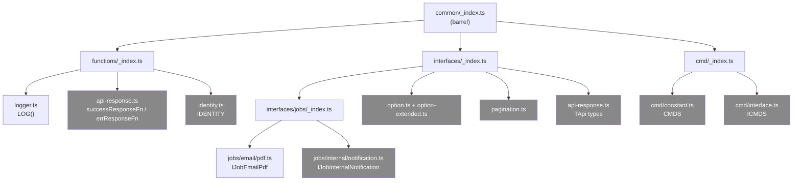

# Módulo: Common

> **Ruta/Namespace:** `src/common/`
> **Responsable histórico:** ⚠️ Pendiente de verificar
> **Criticidad:** 🟡 Media
> **Estado:** Activo (con dead code significativo)

---

## Propósito

Módulo de código compartido que provee utilidades, interfaces de tipos y contratos de datos usados por el worker y potencialmente por otros microservicios del ecosistema Muvin. Actúa como biblioteca interna. Contiene tanto código activamente usado por el worker como código que parece copiado del API principal sin adaptación.

---

## Funcionalidades que expone

| # | Funcionalidad | Descripción breve | Usado en worker | Detalle |
|---|--------------|------------------|:--------------:|---------|
| 2.1 | `LOG` | Logger con colores ANSI sobre NestJS Logger | ✅ Sí | `src/common/functions/logger.ts` |
| 2.2 | `IJobEmailPdf` | Contrato del payload del job `email.pdf` | ✅ Sí | `src/common/interfaces/jobs/email/pdf.ts` |
| 2.3 | `IJobInternalNotification` | Contrato del payload del job `internal.notification` | ❌ No | `src/common/interfaces/jobs/internal/notification.ts` |
| 2.4 | `CMDS` / `ICMDS` | Message patterns del ecosistema Muvin | ❌ No | `src/common/cmd/constant.ts` |
| 2.5 | `successResponseFn` / `errResponseFn` | Constructores de respuesta HTTP | ❌ No | `src/common/functions/api-response.ts` |
| 2.6 | `IDENTITY` | Función identidad genérica `<T>(x:T)=>T` | ❌ No | `src/common/functions/identity.ts` |
| 2.7 | `IOption<T>`, `IOptionExtended<T>` | Interfaces de opciones de select/dropdown | ❌ No | `src/common/interfaces/option*.ts` |
| 2.8 | `IPagination` | Interface de paginación | ❌ No | `src/common/interfaces/pagination.ts` |
| 2.9 | `TApi`, `TApiSuccessResponse`, `TApiErrorResponse` | Tipos de respuesta de API | ❌ No | `src/common/interfaces/api-response.ts` |

---

## Dependencias

- **Depende de:** ningún módulo interno del proyecto
- **Es usado por:** [[modulo-email]], `main.ts`, `module.ts`

---

## Diagrama de componentes internos

*Gris = componente sin uso activo en el worker.*

---

## Riesgos y deuda técnica detectados

- ⚠️ Dead code estimado: ~65% de las exportaciones de `common` no son utilizadas por el worker
- ⚠️ `common` parece ser un módulo compartido del monorepo copiado/pegado. Si se actualiza en otro microservicio, los cambios deben sincronizarse manualmente aquí
- ⚠️ `IJobInternalNotification` existe pero la cola `internal` no tiene procesador

---

## Archivos fuente relevantes

- `src/common/_index.ts`
- `src/common/functions/logger.ts`
- `src/common/functions/api-response.ts`
- `src/common/functions/identity.ts`
- `src/common/interfaces/jobs/email/pdf.ts`
- `src/common/interfaces/jobs/internal/notification.ts`
- `src/common/cmd/constant.ts`
- `src/common/cmd/interface.ts`
