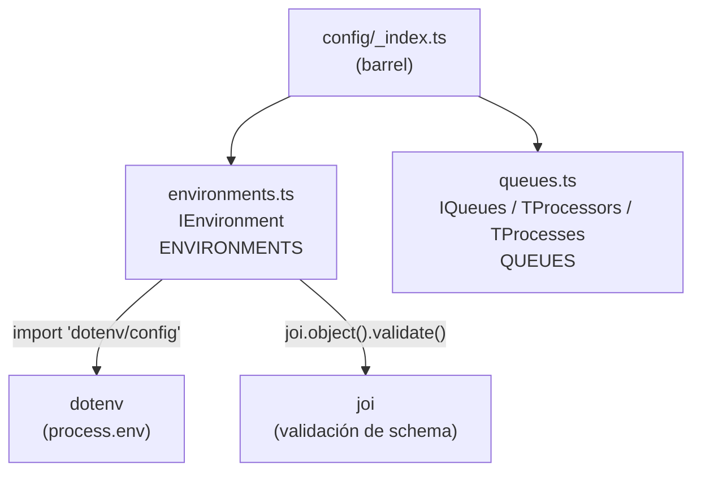

# Módulo: Config

> **Ruta/Namespace:** `src/config/`
> **Responsable histórico:** ⚠️ Pendiente de verificar
> **Criticidad:** 🔴 Alta
> **Estado:** Activo

---

## Propósito

Centraliza la configuración del proceso worker. Define y valida las variables de entorno necesarias para la conexión con Redis (broker de Bull), y tipifica las colas y procesos Bull del sistema. Es la única fuente de verdad para los nombres de colas y procesos.

---

## Funcionalidades que expone

| # | Funcionalidad | Descripción breve | Detalle |
|---|--------------|------------------|---------|
| 3.1 | `ENVIRONMENTS` | Objeto validado de vars de entorno (HOST, PORT para Redis) | `src/config/environments.ts` |
| 3.2 | `QUEUES` | Definición tipada de colas y procesos Bull | `src/config/queues.ts` |

---

## Dependencias

- **Depende de:** `dotenv`, `joi` (paquetes externos únicamente)
- **Es usado por:** [[modulo-email]], `module.ts`

---

## Diagrama de componentes internos



---

## Variables de entorno requeridas

| Variable | Tipo | Descripción | Validación |
|----------|------|-------------|------------|
| `HOST` | `string` | Host del servidor Redis | `joi.string().required()` |
| `PORT` | `number` | Puerto del servidor Redis | `joi.number().required()` |

> [!warning] Variables de entorno ausentes
> La configuración solo valida `HOST` y `PORT` (para Redis). Las credenciales de Gmail/Google (clave privada, email de cuenta de servicio) **no se validan aquí** — se pasan dentro del payload de cada job. Esto implica que el worker puede arrancar sin credenciales Gmail configuradas.

---

## Estructura de QUEUES

```typescript
QUEUES = {
  internal: {
    name: 'internal',
    process: {
      notification: 'internal.notification'
    }
  },
  email: {
    name: 'email',
    process: {
      pdf: 'email.pdf'
    }
  }
}
```

| Cola | Proceso | ¿Tiene procesador? |
|------|---------|:-----------------:|
| `email` | `email.pdf` | ✅ Sí (`EmailProcessor`) |
| `internal` | `internal.notification` | 🔴 No |

---

## Riesgos y deuda técnica detectados

- ⚠️ Si `HOST` o `PORT` no están definidos, la app **falla en arranque** con error de validación Joi. Esto es correcto, pero el mensaje de error puede no ser suficientemente descriptivo para un operador
- ⚠️ No hay validación de autenticación Redis (password). Si Redis requiere auth, el error aparece en runtime al intentar conectar, no en arranque
- ⚠️ La cola `internal` está declarada en `QUEUES` pero no tiene procesador registrado en `AppModule`

---

## Archivos fuente relevantes

- `src/config/_index.ts`
- `src/config/environments.ts`
- `src/config/queues.ts`
