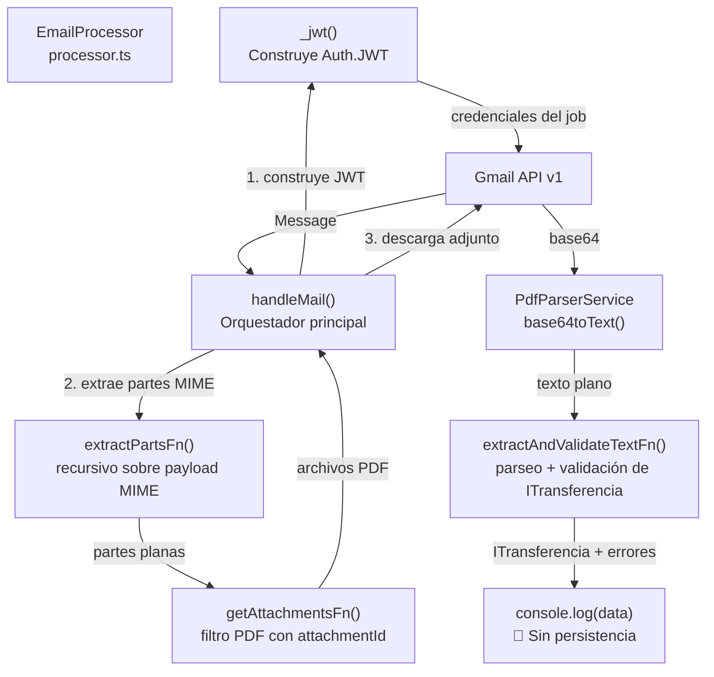

# Módulo: Email Processor

> **Ruta/Namespace:** `src/modules/email/`
> **Responsable histórico:** ⚠️ Pendiente de verificar
> **Criticidad:** 🔴 Alta
> **Estado:** Activo — procesamiento incompleto (sin persistencia del resultado)

---

## Propósito

Este módulo es el **núcleo funcional del worker**. Escucha la cola Bull `email` para el proceso `email.pdf`, conecta con cuentas de Gmail corporativas de Google Workspace mediante autenticación JWT de cuenta de servicio, extrae los adjuntos PDF de los mensajes, y parsea el texto del certificado de transferencia de depósito de granos para obtener los datos estructurados del circuito agropecuario (COE, CUITs, kilos, etc.).

**Advertencia:** el resultado del parseo actualmente se descarta vía `console.log()` sin persistencia ni reenvío.

---

## Funcionalidades que expone

| # | Funcionalidad | Descripción breve | Detalle |
|---|--------------|------------------|---------|
| 1.1 | Procesamiento de job email.pdf | Orquesta Gmail API + PDF parsing + validación de transferencia | [[email-procesamiento-pdf]] |
| 1.2 | Autenticación Gmail JWT | Construye el cliente `Auth.JWT` con credenciales del job | [[email-autenticacion-gmail]] |
| 1.3 | Extracción de partes del mensaje | Recorre recursivamente el árbol de partes MIME de Gmail | [[email-extraccion-partes]] |
| 1.4 | Parseo y validación del certificado | Aplica regex + validaciones de negocio sobre el texto del PDF | [[email-parseo-certificado]] |

---

## Dependencias

- **Depende de:** [[modulo-config]] (QUEUES), [[modulo-common]] (IJobEmailPdf), [[modulo-services]] (PdfParserService)
- **Es usado por:** `AppModule` (registrado como provider)
- **Consume servicios externos:** [[gmail-endpoints]] (Gmail API v1)

---

## Diagrama de componentes internos

---

## Servicios Backend Consumidos

| Verbo | Ruta | Propósito | Detalle |
|-------|------|-----------|---------|
| GET | `gmail/v1/users/{userId}/messages/{id}` | Obtener mensaje completo con payload | [[gmail-endpoints#GET-message]] |
| GET | `gmail/v1/users/{userId}/messages/{messageId}/attachments/{id}` | Descargar adjunto en base64 | [[gmail-endpoints#GET-attachment]] |

---

## Entidades de datos implicadas

[[entidad-job-email-pdf]] (input), [[entidad-transferencia]] (output)

---

## Riesgos y deuda técnica detectados

- 🔴 `console.log(data, name)` en línea final de `handleMail()`: el resultado del parsing **no se persiste ni se reenvía** — funcionalidad incompleta
- 🔴 La clave privada (`auth.key`) viaja en el payload del job dentro de Redis, sin cifrado adicional
- ⚠️ Solo 2 granos hardcodeados en `rt.ts`: TRIGO PAN (id:1) y SOJA (id:2). El sistema fallará con cualquier otro grano
- ⚠️ La validación de `cosecha` solo acepta 5 valores hasta 2728. Se romperá en la campaña 2829
- ⚠️ `console.error` en el catch de `handleMail`: el error se loguea pero se re-lanza, lo que hace que Bull marque el job como fallido y aplique la política de reintentos. Correcto en intención pero sin logging estructurado
- ⚠️ El nombre del archivo PDF (`name`) nunca se usa para nada más que el `console.log` final

---

## Archivos fuente relevantes

- `src/modules/email/processor.ts`
- `src/modules/email/functions/rt.ts`
- `src/modules/email/functions/_index.ts`
