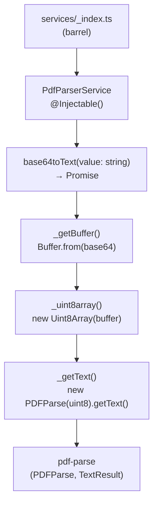

# Módulo: Services

> **Ruta/Namespace:** `src/services/`
> **Responsable histórico:** ⚠️ Pendiente de verificar
> **Criticidad:** 🟡 Media
> **Estado:** Activo

---

## Propósito

Contiene los servicios inyectables compartidos del worker. Actualmente tiene un único servicio: `PdfParserService`, que encapsula la lógica de conversión de datos binarios PDF (en base64) a texto plano estructurado, usando la librería `pdf-parse`.

---

## Funcionalidades que expone

| # | Funcionalidad | Descripción breve | Detalle |
|---|--------------|------------------|---------|
| 4.1 | `PdfParserService.base64toText()` | Convierte string base64 de un PDF a `TextResult` con el texto extraído | `src/services/pdf-parser.ts` |

---

## Dependencias

- **Depende de:** `pdf-parse` (paquete externo)
- **Es usado por:** [[modulo-email]] (`EmailProcessor`)

---

## Diagrama de componentes internos

---

## API de `PdfParserService`

### `base64toText(value: string): Promise<TextResult>`

| Parámetro | Tipo | Descripción |
|-----------|------|-------------|
| `value` | `string` | PDF codificado en base64 (formato que provee la Gmail API) |

**Retorna:** `Promise<TextResult>` — objeto de `pdf-parse` con campo `.text` (string con el texto extraído del PDF).

**Pipeline interno:**
1. `Buffer.from(value, 'base64')` — decodifica base64
2. `new Uint8Array(buffer)` — convierte a buffer binario compatible con `pdf-parse`
3. `new PDFParse(uint8).getText()` — extrae texto

---

## Riesgos y deuda técnica detectados

- ⚠️ `pdf-parse` tiene bajo mantenimiento activo en el ecosistema npm. Si el formato del PDF de los certificados cambia, puede haber errores silenciosos
- ⚠️ No hay manejo de errores en `PdfParserService`: si el base64 es inválido o el PDF está corrupto/cifrado, el error burbujea hasta `handleMail()` donde sí se captura con `try/catch`
- ⚠️ `TextResult` de `pdf-parse` puede incluir caracteres de control, saltos de línea extra o encodings extraños en PDFs escaneados (OCR), lo que podría hacer fallar las regex de `rt.ts`

---

## Archivos fuente relevantes

- `src/services/pdf-parser.ts`
- `src/services/_index.ts`
