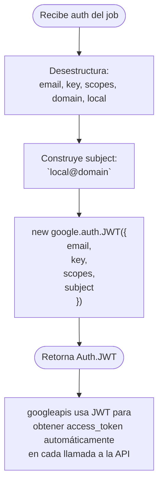

# Funcionalidad: Autenticación Gmail JWT

> **Módulo:** [[modulo-email]]
> **Tipo:** 🔌 Integración con sistema externo
> **Archivo:** `src/modules/email/processor.ts`
> **Método:** `EmailProcessor._jwt(value: IJobEmailPdf['auth']): Auth.JWT`

---

## Descripción funcional

El worker no mantiene credenciales Gmail propias. En cambio, cada job recibe en su payload las credenciales de la cuenta de servicio Google correspondiente a la empresa cuyo correo debe procesar. El método `_jwt()` construye un objeto `Auth.JWT` del SDK de Google que permite autenticar las llamadas a la Gmail API v1 usando el mecanismo de **Domain-wide Delegation** (DWD), impersonando al usuario de Gmail especificado.

---

## Precondiciones

- La cuenta de servicio Google debe tener DWD habilitado en Google Workspace Admin
- Los scopes deben incluir al menos `https://www.googleapis.com/auth/gmail.readonly`
- El campo `subject` (`${local}@${domain}`) debe ser un usuario existente en el dominio de Google Workspace

---

## Flujo principal

---

## Estructura de las credenciales (campo `auth` de `IJobEmailPdf`)

| Campo | Tipo | Descripción |
|-------|------|-------------|
| `email` | `string` | Email de la cuenta de servicio Google (ej: `worker@proyecto.iam.gserviceaccount.com`) |
| `key` | `string` | Clave privada RSA en formato PEM o PKCS12 | 
| `scopes` | `string[]` | Scopes OAuth solicitados (ej: `['https://www.googleapis.com/auth/gmail.readonly']`) |
| `domain` | `string` | Dominio de Google Workspace (ej: `empresa.com`) |
| `local` | `string` | Parte local del email a impersonar (ej: `correo`) → impersona `correo@empresa.com` |

---

## Servicios backend invocados

Este método no realiza llamadas HTTP directamente. El `Auth.JWT` construido se pasa al constructor de `google.gmail()` y el SDK maneja la obtención del access token de forma transparente antes de cada llamada.

---

## Datos que lee/escribe

- **Lee:** `IJobEmailPdf['auth']` (del payload del job Redis)

---

## Riesgos específicos

- 🔴 **La clave privada (`key`) viaja en plaintext dentro del payload del job Redis.** Si Redis no está cifrado o autenticado, cualquier proceso con acceso al broker puede leer estas credenciales. Ver [[security-inventory]]
- ⚠️ El campo `scopes` viene del payload externo. No hay validación de que los scopes sean los esperados; un publicador malicioso podría solicitar scopes más amplios
- ⚠️ Si el subject (`local@domain`) no existe o no tiene los permisos de DWD, la Gmail API retorna un error 401/403 que burbujea hasta el `catch` de `handleMail()`
- ⚠️ No hay rotación de credenciales: si la clave privada se compromete, todos los jobs históricos en Redis tienen la clave expuesta

---

## Archivos fuente relevantes

- `src/modules/email/processor.ts` (método `_jwt()`, líneas ~107-116)
- `src/common/interfaces/jobs/email/pdf.ts` (interface `IJobEmailPdf`)
