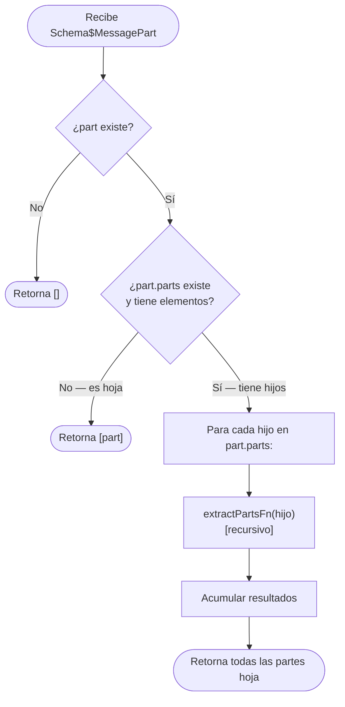

# Funcionalidad: Extracción de Partes MIME del Mensaje

> **Módulo:** [[modulo-email]]
> **Tipo:** 🔧 Utilitario
> **Archivo:** `src/modules/email/functions/rt.ts`
> **Funciones:** `extractPartsFn()`, `getAttachmentsFn()`

---

## Descripción funcional

Los mensajes de Gmail tienen una estructura MIME en árbol: un mensaje puede contener múltiples partes (texto plano, HTML, adjuntos), y cada parte puede a su vez contener sub-partes. `extractPartsFn()` aplana ese árbol recursivamente en un array plano de `Schema$MessagePart[]`. Luego `getAttachmentsFn()` filtra ese array para quedarse solo con los adjuntos PDF que tienen `attachmentId` (es decir, que pueden descargarse por separado).

---

## Precondiciones

- Recibe el `payload` de un `Schema$Message` de Gmail (objeto con posible campo `parts[]`)

---

## Flujo de `extractPartsFn`



---

## Flujo de `getAttachmentsFn`

```mermaid
flowchart TD
    A([Recibe Schema$MessagePart[]]) --> B["Para cada parte:"]
    B --> C{¿filename termina\nen '.pdf'?}
    C -->|No| B
    C -->|Sí| D{¿body.attachmentId\nexiste y es string?}
    D -->|No| B
    D -->|Sí| E["Agregar { id: attachmentId, name: filename }\nal array IRTFile[]"]
    E --> B
    B -->|Fin| F(["Retorna IRTFile[]"])
```

---

## Interface `IRTFile`

```typescript
interface IRTFile {
  readonly id: string;    // body.attachmentId
  readonly name: string;  // filename
}
```

---

## Validaciones de negocio

| Validación | Descripción | Ubicación |
|-----------|-------------|-----------|
| `!part` | Guard: si la parte es undefined/null, retorna `[]` | `rt.ts:5` |
| `filename.toLocaleLowerCase().endsWith('.pdf')` | Solo adjuntos PDF (case-insensitive) | `rt.ts:35` |
| `typeof part.body.attachmentId === 'string'` | Solo adjuntos con ID descargable (los inline no tienen attachmentId) | `rt.ts:43` |

---

## Datos que lee/escribe

- **Lee:** `gmail_v1.Schema$MessagePart` (de la respuesta de Gmail API)
- **Escribe:** `IRTFile[]` (array de metadatos de adjuntos)

---

## Riesgos específicos

- ⚠️ La comparación `filename.toLocaleLowerCase().endsWith('.pdf')` puede incluir archivos con nombre `.PDF` en mayúsculas — esto está bien manejado. Sin embargo, no detecta PDFs disfrazados con otra extensión
- ⚠️ No hay límite en la cantidad de adjuntos a procesar. Un correo con 100 PDFs adjuntos dispararía 100 llamadas secuenciales a la Gmail API y 100 parseos de PDF en el mismo job

---

## Archivos fuente relevantes

- `src/modules/email/functions/rt.ts` (funciones `extractPartsFn` y `getAttachmentsFn`, líneas 1-56)
