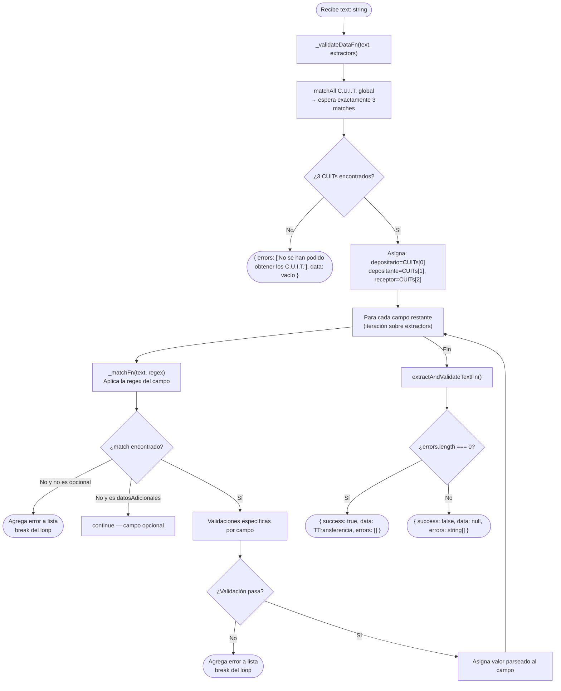

# Funcionalidad: Parseo y Validación del Certificado de Transferencia

> **Módulo:** [[modulo-email]]
> **Tipo:** 🔄 Proceso automático
> **Archivo:** `src/modules/email/functions/rt.ts`
> **Función principal:** `extractAndValidateTextFn(text: string)`

---

## Descripción funcional

A partir del texto plano extraído de un PDF de certificado de transferencia de depósito de granos (emitido por el sistema SENASA/AFIP), aplica un conjunto de expresiones regulares para extraer los campos clave del documento y luego los valida según las reglas de negocio del dominio agropecuario argentino. Retorna un objeto tipado `ITransferencia` con todos los campos, o un array de errores si alguna validación falla.

---

## Precondiciones

- Recibe el texto plano extraído por `PdfParserService.base64toText()` del PDF del certificado
- El texto debe contener el formato esperado del certificado del SENASA/AFIP (estructura con etiquetas como `C.O.E.:`, `Fecha Emisión:`, `DEPOSITARIO`, etc.)

---

## Campos extraídos (ITransferencia)

| Campo | Regex | Descripción | Restricciones |
|-------|-------|-------------|---------------|
| `coe` | `/C\.O\.E\.\:\s*(\d+)/i` | Código Único de Operación | Entero, positivo, máximo 12 dígitos |
| `fechaEmision` | `/Fecha\s+Emisi[oó]n\:\s*(\d{2}\/\d{2}\/\d{4})/i` | Fecha de emisión del certificado | Formato DD/MM/YYYY; rango 2010 — hoy |
| `cosecha` | `/Campa[ñn]a\:\s*(\d+)/i` | Año de campaña agrícola | Solo: `2324`, `2425`, `2526`, `2627`, `2728` ⚠️ |
| `cuitDepositario` | (matchAll global) | CUIT del depositario del grano | 11 dígitos, primer match |
| `cuitDepositante` | (matchAll global) | CUIT del depositante | 11 dígitos, segundo match |
| `cuitReceptor` | (matchAll global) | CUIT del receptor del grano | 11 dígitos, tercer match |
| `nroPlanta` | `/N[°º]\s*de\s+Planta\:\s*(\d+)/i` | Número de planta de almacenamiento | Entero, positivo, máximo 8 dígitos |
| `nroCertificado` | `/DETALLE\s+DE\s+TRANSFERENCIA.*?\n\s*(\d+)/i` | Número de certificado | Entero, positivo, máximo 12 dígitos |
| `kilos` | `/(\d+(?:\.\d+)?)\s*Kg/i` | Kilos transferidos | Decimal (hasta 2 decimales), positivo |
| `codigoGrano` | `/Grano\s+y\s+Tipo\:\s*([A-ZÁÉÍÓÚÑ\s]+?)/i` | Nombre del grano → se resuelve a ID | Solo `TRIGO PAN` (id:1) o `SOJA` (id:2) ⚠️ |
| `datosAdicionales` | `/Datos\s+Adicionales\:\s*(.+?)/i` | Observaciones opcionales | Máximo 255 caracteres, opcional |

---

## Flujo principal

---

## Validaciones de negocio por campo

| Campo | Regla de validación |
|-------|-------------------|
| `cuitDepositario/ante/Receptor` | Se extraen con `matchAll` global. Se esperan exactamente 3 CUITs en el documento |
| `fechaEmision` | Debe ser `DD/MM/YYYY` o `DD-MM-YYYY`; convertida a `YYYY-MM-DD`; posterior a 2010-01-01; no futura |
| `cosecha` | Exactamente 4 dígitos; años consecutivos; solo valores: `2324`, `2425`, `2526`, `2627`, `2728` |
| `coe` | Solo dígitos, máximo 12 |
| `nroCertificado` | Solo dígitos, máximo 12 |
| `nroPlanta` | Solo dígitos, máximo 8 |
| `codigoGrano` | El nombre extraído debe encontrar match en array `grains` (solo TRIGO PAN y SOJA) |
| `kilos` | Regex `/^\d+(\.\d{1,2})?$/`; positivo; hasta 2 decimales |
| `datosAdicionales` | Máximo 255 caracteres; opcional |

---

## Datos que lee/escribe

- **Lee:** `string` (texto plano del PDF)
- **Produce:** `{ success: boolean, data: TTransferencia | null, errors: string[] }`

---

## Riesgos específicos

- 🔴 **Solo 2 granos hardcodeados**: TRIGO PAN y SOJA. El parseo fallará para cualquier otro cereal (maíz, girasol, trigo candeal, etc.) sin modificar el código
- 🔴 **Cosechas hardcodeadas**: el sistema dejará de funcionar cuando llegue la campaña `2829` (aproximadamente año 2028-2029) 
- ⚠️ La extracción de CUITs usa `matchAll` global asumiendo que el orden en el documento es siempre: depositario, depositante, receptor. Si el PDF cambia de formato, los CUITs se asignan al rol equivocado silenciosamente
- ⚠️ El loop `for...of _typedEntriesFn(extractors)` usa `break` ante el primer error. No se recolectan todos los errores de validación simultáneamente — el usuario obtiene un error a la vez
- ⚠️ La regex de `kilos` (`/(\d+(?:\.\d+)?)\s*Kg/i`) puede hacer match con números de otras partes del documento si aparece la unidad "Kg" en otro contexto

---

## Archivos fuente relevantes

- `src/modules/email/functions/rt.ts` (funciones `extractAndValidateTextFn`, `_validateDataFn`, `_matchFn`, líneas 60-430)
