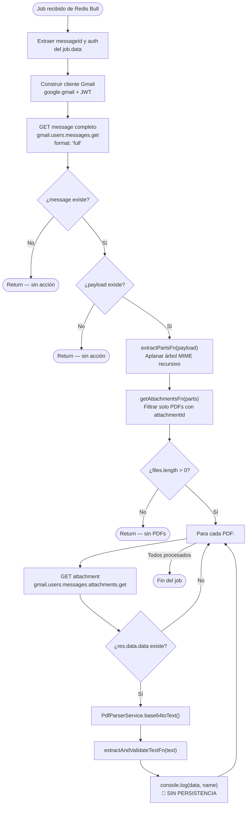
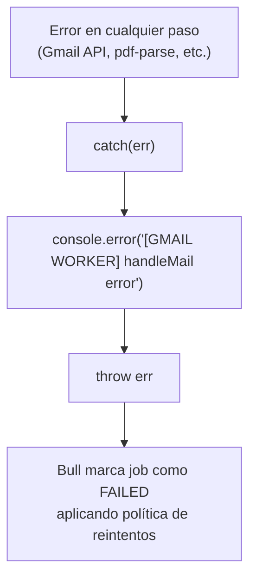

# Funcionalidad: Procesamiento de Job email.pdf

> **Módulo:** [[modulo-email]]
> **Tipo:** 🔄 Proceso automático / Batch
> **Archivo:** `src/modules/email/processor.ts`
> **Handler:** `EmailProcessor.handleMail(job: Job<IJobEmailPdf>)`

---

## Descripción funcional

Cuando el API principal de Muvin detecta un correo electrónico corporativo de Google Workspace con un adjunto PDF de certificado de transferencia de depósito de granos, publica un job en la cola Redis Bull `email` (proceso `email.pdf`). Este worker consume ese job, accede a Gmail en nombre de la empresa usando las credenciales JWT incluidas en el payload, descarga el o los adjuntos PDF, los parsea y extrae los datos estructurados del certificado. **Actualmente el resultado no se persiste ni se reenvía.**

---

## Precondiciones

- Redis accesible en `HOST:PORT` (validado en arranque)
- El API principal debe haber publicado un job con estructura `IJobEmailPdf` válida
- Las credenciales Gmail en `job.data.auth` deben corresponder a una cuenta de servicio Google con Domain-wide Delegation activo para el dominio corporativo indicado
- El mensaje Gmail (`messageId`) debe existir y contener al menos un adjunto PDF

---

## Flujo principal

---

## Flujos alternativos / excepciones

### Error en cualquier paso

> [!warning] Reintentos Bull
> Al relanzar el error, Bull aplica su política de reintentos por defecto. Si no se configuraron opciones de `attempts` al agregar el job, el job falla definitivamente sin reintentos.

---

## Validaciones de negocio

| Validación | Comportamiento | Ubicación en código |
|-----------|---------------|---------------------|
| `message === undefined` | Return silencioso | `processor.ts:55` |
| `payload === undefined` | Return silencioso | `processor.ts:61` |
| `files.length === 0` | Return silencioso | `processor.ts:77` |
| `!res.data || !res.data.data` | `continue` (salta ese archivo) | `processor.ts:87` |

> [!warning] Fallas silenciosas
> Los returns silenciosos hacen que el job se considere **exitoso** (no falla, no reintenta) aunque no se haya procesado nada. No hay logging de estos casos. Ver [[deuda-tecnica]].

---

## Servicios backend invocados

| Paso | Verbo | Ruta | Payload resumido | Respuesta resumida |
|------|-------|------|-----------------|-------------------|
| 1 | GET | `gmail/v1/users/me/messages/{messageId}` | `format: 'full'` | `Schema$Message` con `payload` (árbol MIME) |
| 2 | GET | `gmail/v1/users/me/messages/{messageId}/attachments/{attachmentId}` | — | `{ data: string (base64) }` |

Ver [[gmail-endpoints]] para detalle.

---

## Datos que lee/escribe

- **Lee:** [[entidad-job-email-pdf]] (payload del job desde Redis)
- **Produce:** [[entidad-transferencia]] (objeto parseado)
- **Escribe en BD:** ❌ Nada actualmente — `console.log()` es el único destino

---

## Riesgos específicos

- 🔴 El resultado del procesamiento no persiste. La funcionalidad está incompleta
- 🔴 La clave privada RSA/PK12 de la cuenta de servicio Google viaja en el payload del job (campo `auth.key`), lo que la expone a cualquier sistema con acceso a Redis
- ⚠️ Los returns silenciosos hacen imposible distinguir "no había PDFs" de "hubo un error de parsing" sin logging adicional
- ⚠️ No se valida que `job.data` tenga la estructura `IJobEmailPdf` esperada antes de desestructurar
