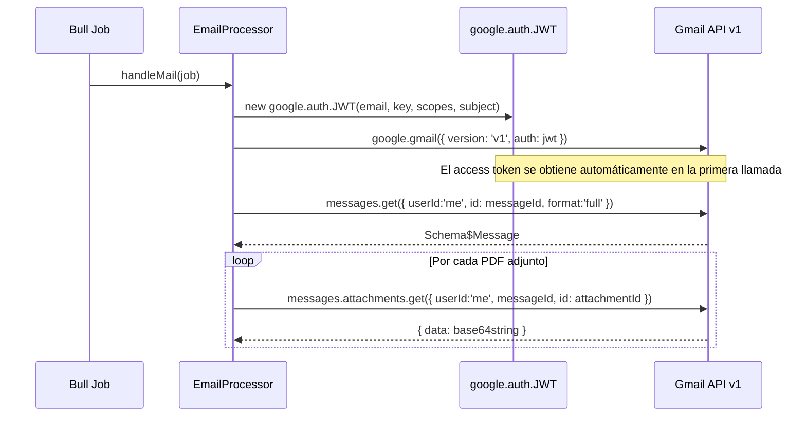

# Servicio Backend: Gmail API v1

> **API:** Gmail API v1
> **Base URL:** `https://gmail.googleapis.com/gmail/v1`
> **Autenticación:** JWT (Service Account) + Domain-wide Delegation
> **Módulo consumidor:** [[modulo-email]]
> **SDK:** `googleapis` ^166.0.0

---

## Descripción

El worker consume dos endpoints de la Gmail API v1 durante el procesamiento de cada job `email.pdf`:

1. **Obtener mensaje completo** (con árbol MIME de partes)
2. **Descargar adjunto** por ID

Ambas llamadas se realizan con la misma instancia de `gmail` inicializada con las credenciales JWT del job.

---

## Endpoints consumidos

### 1. GET — Obtener mensaje completo

| Atributo | Valor |
|---------|-------|
| **Verbo** | `GET` |
| **Ruta SDK** | `gmail.users.messages.get()` |
| **URL real** | `GET /gmail/v1/users/{userId}/messages/{id}` |
| **Autenticación** | JWT impersonando al usuario de Gmail |
| **Módulo** | [[modulo-email]] (`EmailProcessor.handleMail`) |

#### Parámetros de llamada

```typescript
gmail.users.messages.get({
  userId: 'me',           // impersonado por JWT
  id: messageId,          // job.data.gmail.messageId
  format: 'full',         // para obtener árbol MIME completo
})
```

#### Respuesta esperada (`Schema$Message`)

```typescript
{
  id: string,
  threadId: string,
  payload: Schema$MessagePart {   // árbol MIME
    mimeType: string,
    headers: Schema$MessagePartHeader[],
    parts?: Schema$MessagePart[],   // sub-partes recursivas
    body?: {
      attachmentId?: string,
      size: number,
      data?: string,              // base64 inline data (si es pequeño)
    },
    filename?: string
  }
  // ...otros campos de metadatos
}
```

#### Uso del resultado

El `payload` completo se pasa a `extractPartsFn()` para aplanar el árbol MIME y luego a `getAttachmentsFn()` para filtrar PDFs.

#### Condiciones de error

| Código HTTP | Causa | Comportamiento en el worker |
|------------|-------|---------------------------|
| 401 Unauthorized | JWT inválido, expirado, o DWD no configurado | `catch` → `console.error` → `throw` → Bull falla el job |
| 403 Forbidden | Sin permiso DWD o scope insuficiente | Ídem |
| 404 Not Found | `messageId` no existe | Ídem |

---

### 2. GET — Descargar adjunto

| Atributo | Valor |
|---------|-------|
| **Verbo** | `GET` |
| **Ruta SDK** | `gmail.users.messages.attachments.get()` |
| **URL real** | `GET /gmail/v1/users/{userId}/messages/{messageId}/attachments/{id}` |
| **Autenticación** | JWT impersonando al usuario de Gmail |
| **Módulo** | [[modulo-email]] (`EmailProcessor.handleMail`) |

#### Parámetros de llamada

```typescript
gmail.users.messages.attachments.get({
  userId: 'me',               // impersonado por JWT
  messageId: messageId,       // ID del mensaje Gmail
  id: file.id,                // attachmentId del archivo PDF
})
```

#### Respuesta esperada (`Schema$MessagePartBody`)

```typescript
{
  size: number,
  data: string    // contenido del adjunto en base64url
}
```

> [!note] Base64 URL-safe
> La Gmail API devuelve los datos en **base64 URL-safe** (usando `-` y `_` en lugar de `+` y `/`). La librería `pdf-parse` y `Buffer.from()` manejan esto correctamente con la encoding `'base64'`.

#### Uso del resultado

`res.data.data` (string base64) se pasa directamente a `PdfParserService.base64toText()`.

#### Condiciones de error

| Código HTTP | Causa | Comportamiento en el worker |
|------------|-------|---------------------------|
| 401/403 | JWT inválido o scope insuficiente | `catch` → `throw` → Bull falla el job |
| 404 | `attachmentId` no existe | `catch` → `throw` → Bull falla el job |

---

## Ciclo de vida del cliente Gmail



---

## Scopes OAuth requeridos

| Scope | Permiso |
|-------|---------|
| `https://www.googleapis.com/auth/gmail.readonly` | Leer mensajes y adjuntos |

> [!tip] Scope mínimo
> El worker solo lee mensajes, no modifica ni envía. El scope `gmail.readonly` es suficiente y es el más restrictivo posible. Esto es correcto desde el punto de vista de seguridad (principio de mínimo privilegio).

---

## Archivos fuente relevantes

- `src/modules/email/processor.ts` (método `handleMail()`)
