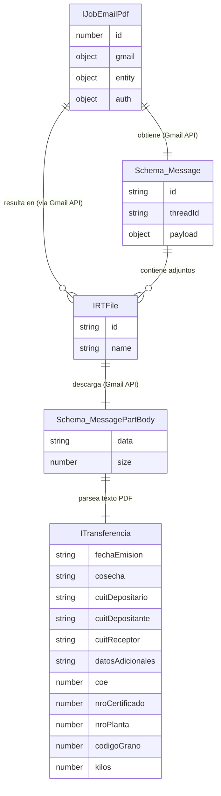

# Índice de Entidades / Modelo de Datos

> **Proyecto:** `muvin-ms-worker`
> **Última revisión:** 2026-04-21

---

> [!note] Sin base de datos propia
> Este worker **no tiene ORM ni base de datos**. No escribe datos en ningún almacén. Las entidades documentadas aquí son los contratos de datos que fluyen entre componentes durante el procesamiento de jobs.

---

## Entidades del sistema

| # | Entidad | Tipo | Módulo | Descripción | Detalle |
|---|---------|------|--------|-------------|---------|
| 1 | `IJobEmailPdf` | Interface TypeScript | [[modulo-common]] | Payload del job Bull que dispara el procesamiento | [[entidad-job-email-pdf]] |
| 2 | `ITransferencia` | Interface TypeScript | [[modulo-email]] | Datos extraídos y validados del PDF | [[entidad-transferencia]] |
| 3 | `IRTFile` | Interface TypeScript | [[modulo-email]] | Metadatos de un adjunto PDF de Gmail | Documentado en [[email-extraccion-partes]] |
| 4 | `IJobInternalNotification` | Interface TypeScript | [[modulo-common]] | Payload del job interno (sin procesador) | Documentado en [[modulo-common]] |

---

## Diagrama ER global (flujo de datos)

