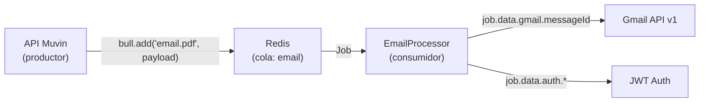

# Entidad: IJobEmailPdf

> **Tipo:** Interface TypeScript
> **Archivo:** `src/common/interfaces/jobs/email/pdf.ts`
> **Módulo:** [[modulo-common]]
> **Rol:** Payload del job Bull publicado por el API Muvin a la cola `email` (proceso `email.pdf`)

---

## Descripción

Define la estructura del mensaje que fluye por Redis desde el API principal de Muvin hasta este worker. Es el punto de entrada de datos de todo el pipeline de procesamiento.

---

## Definición TypeScript

```typescript
interface IJobEmailPdf {
  id: number;
  gmail: {
    messageId: string;
  };
  entity: {
    id: number;
    rs: string;
    cuit: string;
  };
  auth: {
    email: string;
    key: string;
    scopes: string[];
    domain: string;
    local: string;
  };
}
```

---

## Descripción de campos

### Nivel raíz

| Campo | Tipo | Descripción | Notas |
|-------|------|-------------|-------|
| `id` | `number` | ID del registro interno en el API Muvin | Usado para correlacionar el job con la entidad en la BD del API |
| `gmail` | `object` | Información del mensaje Gmail | Ver sub-campos |
| `entity` | `object` | Información de la empresa/entidad corporativa | Ver sub-campos |
| `auth` | `object` | Credenciales de la cuenta de servicio Google | 🔴 Sensible |

### Sub-objeto `gmail`

| Campo | Tipo | Descripción |
|-------|------|-------------|
| `messageId` | `string` | ID del mensaje en Gmail (identificador único en la bandeja del usuario) |

### Sub-objeto `entity`

| Campo | Tipo | Descripción |
|-------|------|-------------|
| `id` | `number` | ID de la empresa en la BD del API Muvin |
| `rs` | `string` | Razón social de la empresa |
| `cuit` | `string` | CUIT de la empresa (11 dígitos) |

### Sub-objeto `auth`

| Campo | Tipo | Descripción | Riesgo |
|-------|------|-------------|--------|
| `email` | `string` | Email de la Service Account de Google (`xxx@project.iam.gserviceaccount.com`) | — |
| `key` | `string` | Clave privada RSA/PEM de la Service Account | 🔴 Alta sensibilidad — viaja en Redis sin cifrar |
| `scopes` | `string[]` | Scopes OAuth a solicitar (ej: `gmail.readonly`) | — |
| `domain` | `string` | Dominio de Google Workspace (ej: `empresa.com`) | — |
| `local` | `string` | Parte local del email impersonado (ej: `correo` → `correo@empresa.com`) | — |

---

## Flujo del payload



---

## Relaciones

- **Produce:** `ITransferencia` (datos extraídos del PDF)
- **Usa:** `IJobEmailPdf['auth']` → construye `Auth.JWT` en `_jwt()`

---

## Riesgos de seguridad

- 🔴 El campo `auth.key` (clave privada RSA) circula en texto plano por Redis. Si Redis no tiene autenticación o cifrado en tránsito (TLS), las credenciales quedan expuestas
- ⚠️ No hay validación de la estructura del payload al momento de consumir el job. Si el API publica un payload malformado, el error ocurrirá en tiempo de ejecución dentro de `handleMail()`

Ver [[security-inventory]] para análisis completo.
