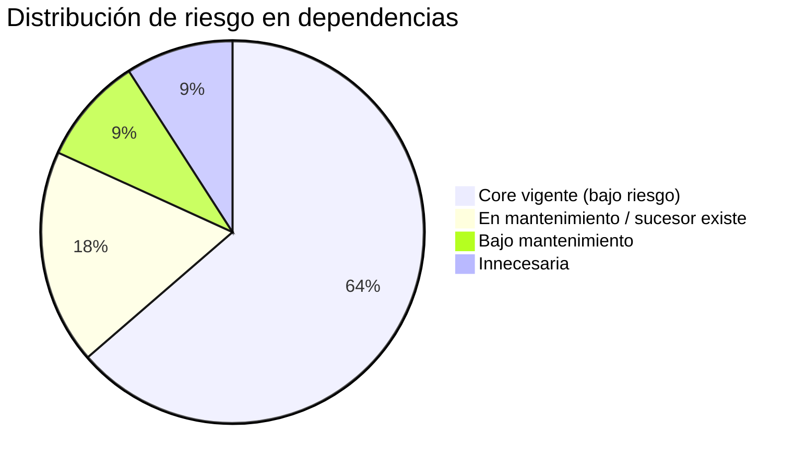

# Dependencias Core vs. Custom

> **Proyecto:** `muvin-ms-worker`
> **Última revisión:** 2026-04-21
> **Ver también:** [[stack-tecnologico]], [[deuda-tecnica]]

---

## Dependencias de producción

### Core del framework / vendor

Dependencias mantenidas por terceros con soporte activo:

| Paquete | Versión | Categoría | Alternativa moderna | Estado |
|---------|---------|-----------|---------------------|--------|
| `@nestjs/common` | ^11.1.9 | Framework | — (es la última versión mayor) | ✅ Core, vigente |
| `@nestjs/core` | ^11.1.9 | Framework | — | ✅ Core, vigente |
| `@nestjs/bull` | ^11.0.4 | Framework addon | `@nestjs/bullmq` | 🟡 Bull v4 en mantenimiento, BullMQ es el sucesor |
| `bull` | ^4.16.5 | Cola de tareas | `bullmq` | 🟡 En mantenimiento, no desarrollo activo |
| `googleapis` | ^166.0.0 | SDK externo | — (es el SDK oficial de Google) | ✅ Vigente |
| `rxjs` | ^7.8.2 | Reactivo | — | ✅ Vigente (requerido por NestJS) |
| `reflect-metadata` | ^0.2.2 | Polyfill | — | ✅ Requerido por NestJS decorators |
| `dotenv` | ^17.2.3 | Config | — | ✅ Vigente |
| `joi` | ^18.0.2 | Validación | `zod` (alternativa más TypeScript-native) | ✅ Vigente |
| `pdf-parse` | ^2.4.5 | Parsing | `pdfjs-dist`, `unpdf` | ⚠️ Bajo mantenimiento |

### Dependencias innecesarias en este contexto

| Paquete | Motivo de inclusión probable | Por qué sobra | Acción recomendada |
|---------|-----------------------------|--------------|--------------------|
| `@nestjs/platform-express` | Incluido por defecto en proyectos NestJS | El worker no tiene servidor HTTP | 🔴 Remover — reduce attack surface y peso |

---

## Dependencias de desarrollo

### Herramientas de build y tipos

| Paquete | Propósito | Estado |
|---------|-----------|--------|
| `typescript` ^5.9.3 | Compilación | ✅ Vigente |
| `@nestjs/cli` ^11.0.13 | Build (`nest build`) | ✅ Vigente |
| `ts-node` ^10.9.2 | Ejecución dev | ✅ Vigente |
| `tsconfig-paths` ^4.2.0 | Resolución de aliases en dev | ✅ Vigente |
| `typescript-transform-paths` ^3.5.5 | Transforma aliases en build prod | ✅ Vigente |
| `source-map-support` ^0.5.21 | Stack traces con líneas TypeScript | ✅ Vigente |
| `ts-loader` ^9.5.4 | Loader webpack para TS | ⚠️ NestJS CLI usa `tsc`, no webpack normalmente |

### Calidad de código

| Paquete | Propósito | Estado |
|---------|-----------|--------|
| `eslint` ^9.39.1 | Linting (flat config v9) | ✅ Vigente |
| `typescript-eslint` ^8.48.0 | Plugin TS para ESLint | ✅ Vigente |
| `eslint-config-prettier` ^10.1.8 | Desactiva reglas ESLint que conflictúan con Prettier | ✅ Vigente |
| `eslint-plugin-prettier` ^5.5.4 | Ejecuta Prettier como regla ESLint | ✅ Vigente |
| `prettier` ^3.7.0 | Formateo | ✅ Vigente |
| `husky` ^9.1.7 | Git hooks | ✅ Vigente |
| `lint-staged` ^16.2.7 | Lint solo de staged files | ✅ Vigente |

### Tipos TypeScript

| Paquete | Propósito | Estado |
|---------|-----------|--------|
| `@types/node` ^24.10.1 | Tipos para Node.js API | ✅ Vigente |
| `@types/express` ^5.0.5 | Tipos para Express | ⚠️ Solo necesario porque `@nestjs/platform-express` está incluido |
| `@types/pdf-parse` ^1.1.5 | Tipos para pdf-parse | ✅ Vigente |
| `globals` ^16.5.0 | Globals para ESLint flat config | ✅ Vigente |

---

## Customizaciones propias del proyecto

Código propio del proyecto (no dependencias externas):

| Componente | Tipo | Bloqueado | Notas |
|-----------|------|-----------|-------|
| `extractAndValidateTextFn` (rt.ts) | Lógica de parsing con regex | No | Totalmente remplazable |
| `grains` hardcodeado (rt.ts) | Dato de negocio embebido | No | Debe externalizarse a BD o config |
| `cosecha` hardcodeado (rt.ts) | Validación temporal hardcodeada | No | 🔴 Se rompe en 2028 |
| `LOG` (logger.ts) | Logger con colores ANSI | No | Podría remplazarse con `pino` o `winston` |
| `CMDS` (cmd/constant.ts) | Message patterns del ecosistema | Depende del API principal | Código compartido de monorepo |

---

## Resumen de riesgo por tipo

