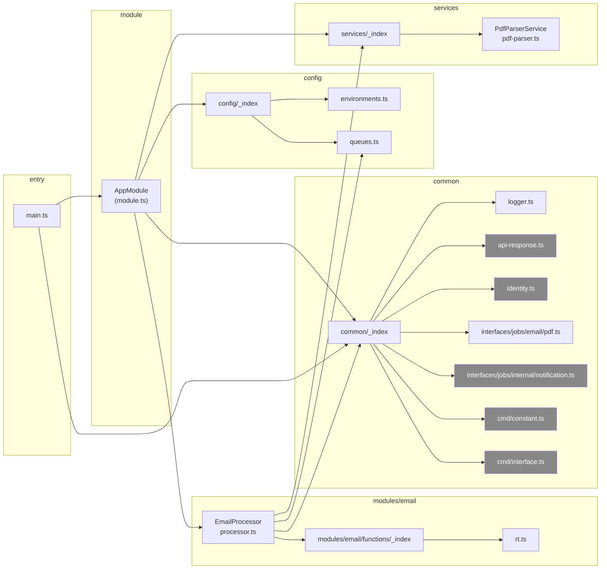

# Dependencias Cross-Módulo

> **Proyecto:** `muvin-ms-worker`
> **Última revisión:** 2026-04-21
> **Ver también:** [[depends-matrix]], [[functional-classification]]

---

## Diagrama de dependencias entre módulos/capas

*Nodos grises = componentes definidos pero no activamente consumidos por la lógica de negocio.*

---

## Análisis de dependencias por componente

### `main.ts`
- **Importa:** `AppModule`, `LOG` (de `@common`)
- **No importa:** nada de `@config` directamente

### `module.ts` (AppModule)
- **Importa:** `BullModule` (NestJS), `ENVIRONMENTS` y `QUEUES` (de `@config`), `LOG` (de `@common`), `PdfParserService` (de `@services`), `EmailProcessor`
- **Patrón:** registra la cola Bull y provee el processor + service en el mismo módulo raíz

### `EmailProcessor`
- **Importa:** `Process`, `Processor` (NestJS Bull), `Job` (bull), `Auth`, `gmail_v1`, `google` (googleapis), `TextResult` (pdf-parse), `QUEUES` (@config), `PdfParserService` (@services), `extractPartsFn`, `getAttachmentsFn`, `extractAndValidateTextFn`, `IRTFile` (local), `IJobEmailPdf` (@common)
- **Patrón:** Inyecta `PdfParserService` por constructor

### `PdfParserService`
- **Importa:** `Injectable` (NestJS), `PDFParse`, `TextResult` (pdf-parse)
- **No importa:** nada de `@common`, `@config`

### `rt.ts`
- **Importa:** `gmail_v1` (googleapis)
- **No importa:** ningún módulo interno del proyecto

---

## Dependencias circulares

**No se detectaron dependencias circulares.** El grafo de dependencias es un DAG (directed acyclic graph) limpio.

---

## Observaciones problemáticas

| Problema | Descripción | Severidad |
|---------|------------|-----------|
| `@contracts` alias fantasma | Definido en `tsconfig.paths.json` sin directorio correspondiente | 🟡 Medio — rompe build si alguien importa ese alias |
| `common` sobredimensionado | Exporta interfaces (`IOption`, `IPagination`) y funciones (`errResponseFn`, `successResponseFn`) no usadas en el worker | 🟡 Medio — indica código copiado de otro microservicio |
| `CMDS` no usado | El objeto de message patterns está definido e importado por `common/_index` pero ningún componente del worker lo consume | 🟡 Medio — dead code |
| `internal` queue sin procesador | `AppModule` NO registra la cola `internal` y no existe `InternalProcessor` | 🔴 Alto — si alguien publica un job `internal.notification`, nadie lo consume y queda pendiente indefinidamente en Redis |
