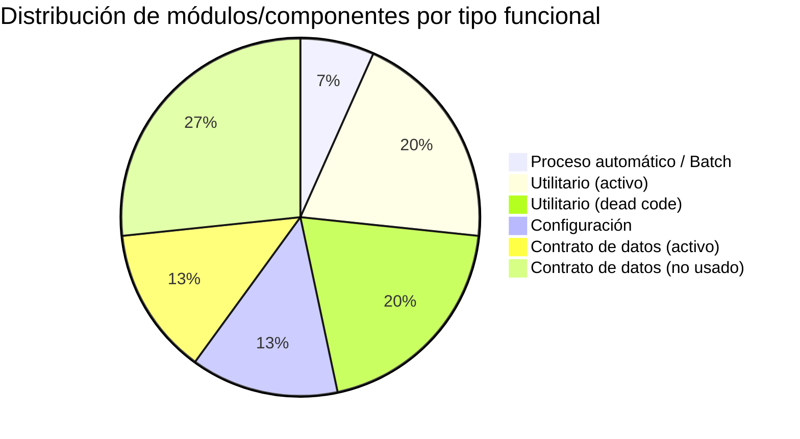

# Clasificación Funcional de Módulos

> **Proyecto:** `muvin-ms-worker`
> **Última revisión:** 2026-04-21
> **Ver también:** [[_indice-modulos]], [[cross-module-dependencies]]

---

## Tabla de clasificación

| Módulo / Componente | Tipo funcional | Descripción en una línea | Estado |
|---------------------|---------------|--------------------------|--------|
| `EmailProcessor` | 🔄 **Batch / Proceso automático** | Consume jobs de la cola `email.pdf`, orquesta Gmail + PDF parsing | Activo |
| `PdfParserService` | 🔧 **Utilitario** | Convierte base64 → texto plano mediante `pdf-parse` | Activo |
| `rt.ts` (funciones) | 🔧 **Utilitario** | Extracción recursiva de partes Gmail, filtro PDFs, parseo + validación de transferencia | Activo |
| `config/environments` | ⚙️ **Configuración** | Validación Joi de variables de entorno (HOST/PORT Redis) | Activo |
| `config/queues` | ⚙️ **Configuración** | Definición tipada de colas y procesos Bull | Activo |
| `common/logger` | 🔧 **Utilitario** | LOG con colores ANSI | Activo |
| `common/identity` | 🔧 **Utilitario** | Función identidad genérica | 💀 No usado |
| `common/api-response` | 🔧 **Utilitario** | Constructores de respuesta HTTP | 💀 No usado en worker |
| `common/interfaces/jobs/email` | 📋 **Contrato de datos** | `IJobEmailPdf` — forma del payload que recibe el worker | Activo |
| `common/interfaces/jobs/internal` | 📋 **Contrato de datos** | `IJobInternalNotification` — cola sin procesador implementado | 🚧 Incompleto |
| `common/cmd` | 📋 **Contrato de datos** | `CMDS` — message patterns del ecosistema Muvin (no usados aquí) | 💀 No usado en worker |
| `common/interfaces/option` | 📋 **Contrato de datos** | `IOption<T>` | 💀 No usado |
| `common/interfaces/option-extended` | 📋 **Contrato de datos** | `IOptionExtended<T>` | 💀 No usado |
| `common/interfaces/pagination` | 📋 **Contrato de datos** | `IPagination` | 💀 No usado |

---

## Distribución por tipo



---

## Resumen ejecutivo

| Tipo | Cantidad | % |
|------|----------|---|
| Proceso automático / Batch | 1 | 7% |
| Utilitario activo | 3 | 21% |
| Utilitario dead code | 3 | 21% |
| Configuración | 2 | 14% |
| Contrato de datos activo | 2 | 14% |
| Contrato de datos no usado | 4 | 28% |

> [!warning] Dead code significativo
> El 49% de los componentes tipificados son dead code o contratos no utilizados en este worker. Parte de este código probablemente se comparte con otros microservicios del ecosistema Muvin. Ver [[deuda-tecnica]].

---

## Módulos funcionales reales

El worker tiene exactamente **un flujo funcional activo**:

```
Cola "email" → proceso "email.pdf"
    └── EmailProcessor.handleMail()
        ├── Gmail API: obtener mensaje
        ├── extractPartsFn() + getAttachmentsFn()
        ├── Gmail API: obtener adjunto
        ├── PdfParserService.base64toText()
        └── extractAndValidateTextFn()  ← resultado: console.log() 🔴
```

La cola `internal` (proceso `internal.notification`) está **definida pero sin procesador**.
