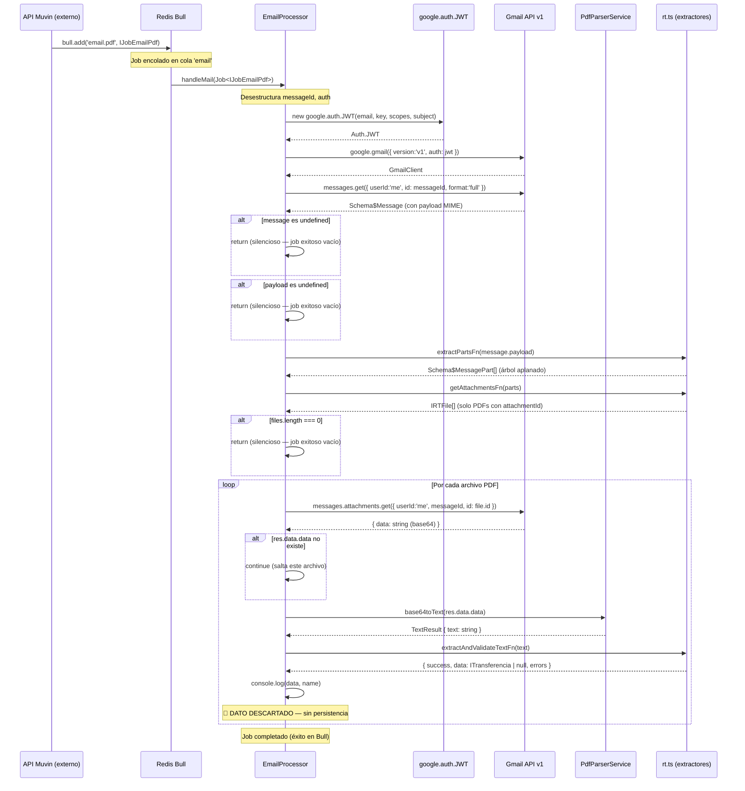
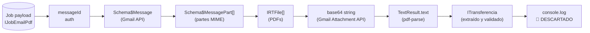
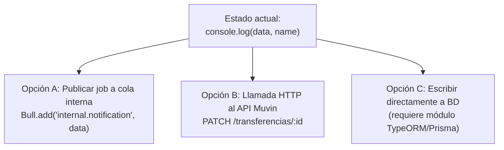

# Flujo: Procesamiento de Certificado de Transferencia de Granos

> **Módulos involucrados:** [[modulo-email]], [[modulo-services]], [[modulo-config]]
> **Disparador:** Job Bull en cola `email`, proceso `email.pdf`
> **Estado del flujo:** 🔴 Incompleto — el resultado no se persiste

---

## Descripción

Flujo de extremo a extremo del procesamiento de un certificado de transferencia de depósito de granos. Comienza cuando el API principal de Muvin detecta un correo de Google Workspace con un PDF adjunto, y termina (actualmente) con el resultado impreso en `console.log()`.

---

## Actores del flujo

| Actor | Sistema | Rol |
|-------|---------|-----|
| API Muvin | Sistema externo (productor) | Publica el job con `messageId` y credenciales |
| Redis | Bull broker | Transporta el job |
| Worker NestJS | Este proceso | Procesa el job |
| Gmail API v1 | Google Cloud | Provee el mensaje y los adjuntos |
| pdf-parse | Librería local | Extrae texto del PDF |

---

## Diagrama de secuencia completo

---

## Estados posibles del job

| Estado Bull | Condición | Comportamiento |
|------------|-----------|---------------|
| `completed` | Flujo normal (con o sin resultados) | Job marcado como exitoso aunque no procesó nada |
| `completed` | `message === undefined` | Return silencioso — éxito vacío |
| `completed` | `payload === undefined` | Return silencioso — éxito vacío |
| `completed` | `files.length === 0` | Return silencioso — éxito vacío |
| `failed` | Cualquier excepción no capturada (Gmail API error, pdf-parse error) | `throw err` → Bull marca como failed |

---

## Diagrama de flujo de datos

---

## Puntos de falla críticos

| # | Punto | Impacto | Causa probable |
|---|-------|---------|---------------|
| 1 | `messages.get()` 401/403 | Job failed + reintentos Bull | JWT inválido, DWD no configurado |
| 2 | `pdf-parse` falla | Job failed | PDF corrupto, cifrado, o escaneado sin OCR |
| 3 | `extractAndValidateTextFn` retorna `success: false` | 🔴 **Silencioso** — el job termina en `completed` | PDF de cultivo no soportado, cosecha futura |
| 4 | `console.log` en lugar de persistencia | 🔴 **Datos perdidos** — diseño incompleto | El worker no tiene cliente BD ni publisher de cola configurado |

---

## Lo que falta para completar el flujo

Ver [[deuda-tecnica]] y [[recomendaciones-modernizacion]] para la recomendación.
