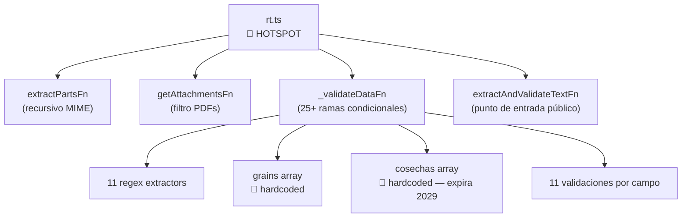

# Hotspots de Complejidad

> **Proyecto:** `muvin-ms-worker`
> **Última revisión:** 2026-04-21
> **Criterio:** Complejidad ciclomática + riesgo de negocio + frecuencia de cambio esperada

---

## Resumen

| Rank | Archivo | Complejidad estimada | Riesgo | Motivo |
|:----:|---------|:--------------------:|:------:|--------|
| 1 | `src/modules/email/functions/rt.ts` | 🔴 Alta | 🔴 Alta | Core de extracción, lógica condicional compleja, datos hardcodeados |
| 2 | `src/modules/email/processor.ts` | 🟡 Media | 🔴 Alta | Orchestrador del flujo, manejo de errores, llamadas a APIs externas |
| 3 | `src/services/pdf-parser.ts` | 🟢 Baja | 🟡 Media | Dependencia externa crítica pero lógica propia minimal |
| 4 | `src/config/environments.ts` | 🟢 Baja | 🟡 Media | Punto de fallo en arranque |
| 5 | `src/module.ts` | 🟢 Baja | 🟢 Baja | Módulo raíz — estable |

---

## Hotspot #1: `src/modules/email/functions/rt.ts`

### Por qué es el hotspot principal

Este archivo es el **core de negocio** del worker. Contiene:

- Toda la lógica de extracción MIME (`extractPartsFn`, `getAttachmentsFn`)
- Todo el motor de extracción regex para el certificado de transferencia
- Todas las reglas de validación del dominio agroindustrial
- Los catálogos hardcodeados (granos, cosechas) que caducan

### Indicadores de complejidad

| Indicador | Valor |
|----------|-------|
| Líneas estimadas | ~430 |
| Número de funciones | ~10 |
| Ramas condicionales | ~25+ |
| Regex diferentes | ~11 |
| Loops anidados | 2 (matchAll + iteración de extractors) |
| Hardcoded constants | 2 (grains array, cosechas array) |

### Puntos de cambio más probables

1. **Nueva cosecha** (`2829`): Falla en producción sin tocar el código → requiere deploy de urgencia
2. **Nuevo tipo de grano**: Cualquier certificado de maíz, girasol, etc. falla → requiere código nuevo
3. **Cambio de formato del PDF**: Si SENASA cambia el layout del certificado, múltiples regex dejan de funcionar simultáneamente
4. **Bug en extracción de CUITs**: La lógica de matchAll global asume orden fijo de CUITs en el documento

### Recomendaciones de refactor

- Externalizar `grains` y `cosechas` a configuración/BD consultable en runtime
- Agregar tests unitarios para `_validateDataFn` con fixtures de texto PDF real
- Separar las funciones de extracción MIME (`extractPartsFn`, `getAttachmentsFn`) a un archivo propio
- Agregar logging por campo cuando la extracción falla (actualmente solo se logea el primer error)

---

## Hotspot #2: `src/modules/email/processor.ts`

### Por qué es hotspot secundario

Es el orquestador que une todos los componentes. Un bug aquí afecta todos los jobs.

### Puntos de riesgo específicos

| Punto | Descripción |
|-------|-------------|
| `_jwt()` | Construye auth con clave privada raw del payload |
| Returns silenciosos | 3 puntos donde el job "tiene éxito" sin haber hecho nada |
| `console.log(data, name)` | Bug de diseño: resultado descartado |
| Sin validación de `job.data` | Asume estructura `IJobEmailPdf` sin verificar |

---

## Mapa de dependencias del hotspot principal

