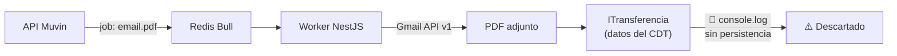

# Documentación Técnica — muvin-ms-worker

> **Proyecto:** `muvin-ms-worker`
> **Stack:** NestJS v11 · Bull · Redis · Gmail API v1 · pdf-parse
> **Tipo:** Worker asíncrono headless — sin servidor HTTP

---

## ¿Qué hace este sistema?

Procesa jobs de una cola Redis (Bull) para descargar, parsear y extraer datos estructurados de certificados de transferencia de depósitos de granos (CDT) adjuntos en correos de Gmail corporativo. Todo el procesamiento es headless — no hay endpoints HTTP.

> [!danger] Estado del sistema
> El worker parsea los certificados correctamente pero **descarta los resultados** con `console.log()`. El pipeline está incompleto — falta el paso de persistencia.

---

## Mapa de la documentación

### 00 — Overview

| Documento | Descripción |
|-----------|-------------|
| [vision-general.md](00-overview/vision-general.md) | Visión general del sistema y su lugar en Muvinapp |
| [arquitectura-alto-nivel.md](00-overview/arquitectura-alto-nivel.md) | Diagrama C4, sequence diagram del arranque |
| [stack-tecnologico.md](00-overview/stack-tecnologico.md) | Tabla de dependencias con versiones, roles y riesgos |
| [glosario.md](00-overview/glosario.md) | Términos del dominio agroindustrial y técnicos |

### 01 — Módulos

| Documento | Descripción |
|-----------|-------------|
| [_indice-modulos.md](01-modulos/_indice-modulos.md) | Tabla de todos los módulos NestJS |
| [modulo-email.md](01-modulos/modulo-email.md) | El módulo principal — EmailProcessor |
| [modulo-services.md](01-modulos/modulo-services.md) | PdfParserService — conversión base64→texto |
| [modulo-config.md](01-modulos/modulo-config.md) | Env vars, definición de colas y procesos |
| [modulo-common.md](01-modulos/modulo-common.md) | Interfaces, tipos y código compartido (65% dead code) |

### 02 — Funcionalidades

| Documento | Descripción |
|-----------|-------------|
| [_indice-funcionalidades.md](02-funcionalidades/_indice-funcionalidades.md) | Tabla de funcionalidades |
| [email-procesamiento-pdf.md](02-funcionalidades/email-procesamiento-pdf.md) | Flujo completo del job email.pdf |
| [email-autenticacion-gmail.md](02-funcionalidades/email-autenticacion-gmail.md) | JWT + Domain-wide Delegation |
| [email-extraccion-partes.md](02-funcionalidades/email-extraccion-partes.md) | Aplanado del árbol MIME + filtrado PDFs |
| [email-parseo-certificado.md](02-funcionalidades/email-parseo-certificado.md) | Regex, validaciones, catálogo de granos/cosechas |

### 03 — Servicios Backend (APIs externas)

| Documento | Descripción |
|-----------|-------------|
| [_indice-servicios.md](03-servicios-backend/_indice-servicios.md) | Tabla de integraciones externas |
| [gmail-endpoints.md](03-servicios-backend/gmail-endpoints.md) | Gmail API v1: messages.get + attachments.get |

### 04 — Modelo de Datos

| Documento | Descripción |
|-----------|-------------|
| [_indice-entidades.md](04-modelo-de-datos/_indice-entidades.md) | Diagrama ER global del flujo de datos |
| [entidad-job-email-pdf.md](04-modelo-de-datos/entidad-job-email-pdf.md) | Payload del job Bull |
| [entidad-transferencia.md](04-modelo-de-datos/entidad-transferencia.md) | Datos del certificado de transferencia |

### 05 — Inventarios

| Documento | Descripción |
|-----------|-------------|
| [tree-estructura-archivos.md](05-inventarios/tree-estructura-archivos.md) | Árbol anotado con estados de cada archivo |
| [functional-classification.md](05-inventarios/functional-classification.md) | Clasificación funcional (activo / dead code) |
| [data-files-index.md](05-inventarios/data-files-index.md) | Datos hardcodeados, secrets, seeds |
| [cross-module-dependencies.md](05-inventarios/cross-module-dependencies.md) | Grafo de dependencias entre módulos |
| [depends-matrix.md](05-inventarios/depends-matrix.md) | Matriz NxN de dependencias |
| [core-vs-custom-dependencies.md](05-inventarios/core-vs-custom-dependencies.md) | Vendor vs custom |
| [reports-and-wizards-inventory.md](05-inventarios/reports-and-wizards-inventory.md) | El `console.log` bug y flujos de salida |
| [security-inventory.md](05-inventarios/security-inventory.md) | Análisis de seguridad OWASP |

### 06 — Flujos Transversales

| Documento | Descripción |
|-----------|-------------|
| [_indice-flujos.md](06-flujos-transversales/_indice-flujos.md) | Índice de flujos |
| [flujo-procesamiento-certificado.md](06-flujos-transversales/flujo-procesamiento-certificado.md) | Flujo end-to-end con sequence diagram completo |

### 08 — Riesgos y Deuda Técnica

| Documento | Descripción |
|-----------|-------------|
| [hotspots.md](08-riesgos-y-deuda-tecnica/hotspots.md) | Archivos más complejos y riesgosos |
| [deuda-tecnica.md](08-riesgos-y-deuda-tecnica/deuda-tecnica.md) | 8 items de deuda catalogados |
| [recomendaciones-modernizacion.md](08-riesgos-y-deuda-tecnica/recomendaciones-modernizacion.md) | Plan de mejoras priorizado |

---

## Resumen ejecutivo de riesgos

| Prioridad | Issue | Documento |
|:---------:|-------|-----------|
| 🔴 P0 | Resultado del procesamiento descartado (`console.log`) | [deuda-tecnica.md](08-riesgos-y-deuda-tecnica/deuda-tecnica.md#DT-01) |
| 🔴 P0 | Clave privada RSA en Redis plaintext | [security-inventory.md](05-inventarios/security-inventory.md#SEC-01) |
| 🔴 P1 | Cosechas hardcodeadas — falla en 2029 | [deuda-tecnica.md](08-riesgos-y-deuda-tecnica/deuda-tecnica.md#DT-02) |
| 🔴 P1 | Solo 2 granos soportados | [deuda-tecnica.md](08-riesgos-y-deuda-tecnica/deuda-tecnica.md#DT-03) |
| 🟡 P2 | Redis sin autenticación | [security-inventory.md](05-inventarios/security-inventory.md#SEC-02) |
| 🟡 P2 | `@contracts` path alias roto | [deuda-tecnica.md](08-riesgos-y-deuda-tecnica/deuda-tecnica.md#DT-04) |

---

## Leyenda de iconos

| Icono | Significado |
|-------|-------------|
| 🔴 | Crítico / Alta severidad |
| 🟡 | Media severidad |
| 🟢 | Baja severidad / OK |
| ✅ | Implementado y funcional |
| 🚧 | Sin implementar |
| ⚠️ | Advertencia / revisar |
| 🔌 | Integración externa |
| 🔧 | Utilitario |
| 🔄 | Proceso automático / batch |
